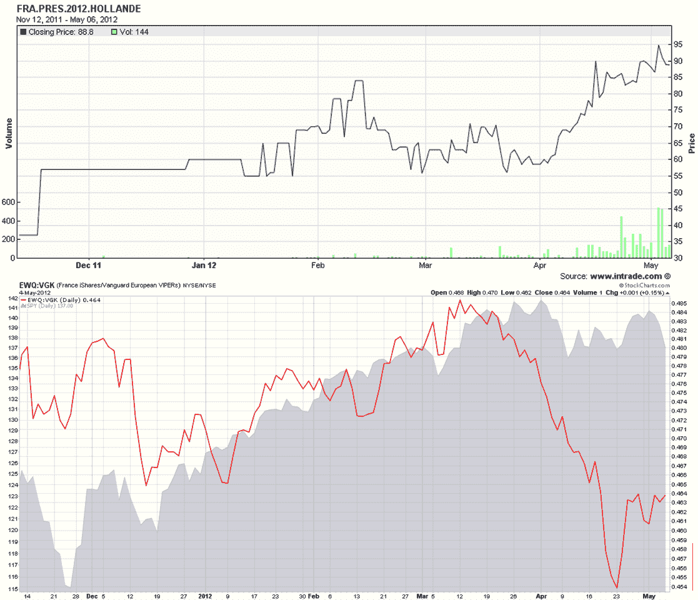
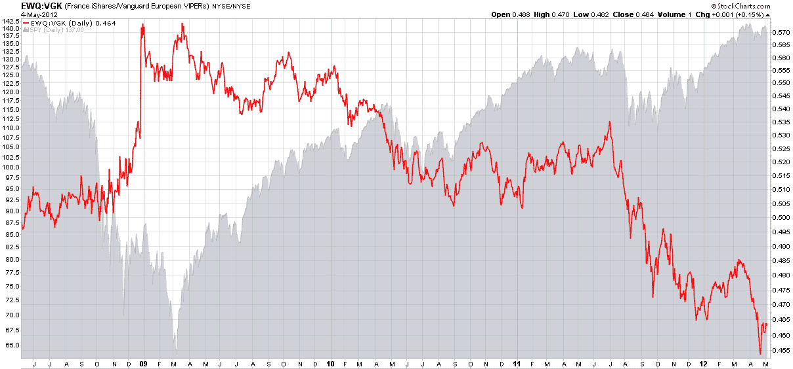

<!--yml

category: 未分类

date: 2024-05-18 16:30:57

-->

# VIX and More：奥朗德折扣

> 来源：[`vixandmore.blogspot.com/2012/05/hollande-discount.html#0001-01-01`](http://vixandmore.blogspot.com/2012/05/hollande-discount.html#0001-01-01)

距离欧洲股市开盘还有一个多小时，投资者仍在努力消化弗朗索瓦·奥朗德在[法国](http://vixandmore.blogspot.com/search/label/France)的选举胜利的重要性，以及[希腊](http://vixandmore.blogspot.com/search/label/Greece)政治场景更为分散的情况，其中激进的左翼[Syriza](http://vixandmore.blogspot.com/search/label/Syriza)党派表现出惊人的实力。

尽管希腊选举结果很难预测，但在过去一个多月里，奥朗德获胜的概率显著增加。

这周的[图表](http://vixandmore.blogspot.com/search/label/chart%20of%20the%20week)显示了自 11 月第二周以来由[Intrade](http://vixandmore.blogspot.com/search/label/Intrade)选举合约（顶部图表上半部分的实线黑色线）指示的奥朗德获胜的可能性。与此同时，可以看到对奥朗德获胜的预期给法国 ETF（[EWQ](http://vixandmore.blogspot.com/search/label/EWQ)）施加了压力。顶部图表下半部分显示了 EWQ 相对于更广泛的欧洲 ETF [VGK](http://vixandmore.blogspot.com/search/label/VGK) 的比率，为实线红色线。自三月中旬以来，该比率随着奥朗德在民调中的力量增强而急剧下降，并且与美国股票（灰色区域图表）的走势相反。

为了更多背景信息，我还包括了底部图表，显示了过去四年中 EWQ:VGK 比率和 SPY 的情况。请注意，法国在 2011 年 6 月之前通常是欧元区相对强势的来源，并且在过去一年大部分时间里相对于其同行表现不佳。

看完所有的图表，显而易见市场已经在过去一个月里定价了奥朗德可能获胜的影响。在我撰写这篇文章时，美国股市期货下跌约 1%。我感觉奥朗德折扣几乎完全被定价进去了，但希腊的不确定性可能会搅动市场，并至少在未来几周内增加波动率预期。

相关帖子：

**

**

*[来源：StockCharts.com, Intrade.com]*

***披露事项：*** *无*
