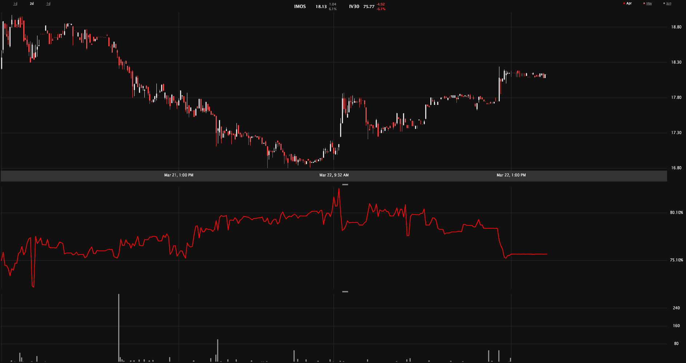

<!--yml

类别：未分类

日期：2024-05-18 16:35:29

-->

# VIX 和更多：IMOS 传奇，Cramer 和期权

> 来源：[`vixandmore.blogspot.com/2012/03/imos-saga-cramer-and-options.html#0001-01-01`](http://vixandmore.blogspot.com/2012/03/imos-saga-cramer-and-options.html#0001-01-01)

我必须承认，当我两周前首次发布关于 ChipMOS 技术（百慕大）有限公司（[IMOS](http://vixandmore.blogspot.com/search/label/IMOS)）的文章时，我从未想到过可能会有后续文章，更不用说故事还有两章了，然而现在我们就在这里。

有一段时间，我觉得 IMOS 在周二的反弹已经结束，就在我写[IMOS 两周内上涨 54%；隐含波动率仍落后于历史波动率](http://vixandmore.blogspot.com/2012/03/imos-up-54-in-two-weeks-iv-still-lags.html)的时候。那天结束时，股票似乎在寻找某种回调后的平衡，其中剧烈的价格行动可能会演变成某种形式的整理。

那个场景昨晚受到了一点冲击，当一个来电者[询问](http://www.cnbc.com/id/46811511?__source=yahoo%7Cheadline%7Cquote%7Ctext%7C&par=yahoo)Jim Cramer 在 Cramer 的“Lightning Round”环节中关于 IMOS 的看法。现在我以为 Cramer 从未遇到过没有看法的股票，但显然他的回应的核心是他需要做一些研究，然后才能提供一些评论和一个赞成或反对的拇指。

当然，我们无法知道 Cramer 对 IMOS 可能有什么看法，但已经有了一位 Seeking Alpha 的贡献者站出来为[Jim Cramer – 你需要了解关于 ChipMOS 的](http://seekingalpha.com/article/450441-jim-cramer-here-s-what-you-need-to-know-about-chipmos?source=yahoo)牛市观点。

无论 Cramer 的决定是什么，他无疑会激发对 IMOS 的更多兴趣。如果历史可以作为指导，他的评论有很大可能性会显著推动股价。

所有这些都让我回到了我的最初帖子，[IMOS 突破，但隐含波动率未能作出反应](http://vixandmore.blogspot.com/2012/03/imos-breaking-out-but-implied.html)。即使 Cramer 的意见可能不一定对股票有方向性影响，你认为期权投资者可能会将即将到来的 Cramer 言论（我假设他会履行他的承诺，提供意见）视为可能引发波动率上升的触发器。然而，令我惊讶的是，IMOS 的 30 日[隐含波动率](http://vixandmore.blogspot.com/search/label/implied%20volatility)今天下降了 6.1%，目前比相应的 20 日历史波动率低 17 点。下方的两天价格和隐含波动率图表显示，虽然 IV 在今天开盘后确实激增，但此后一直在下降。

正如两周前的情况一样，我再次怀疑 IV 正在低估该股票未来的走势，但这次我打算成为一个旁观者而非参与者。然而，有人应该正在享受这次旅程。

相关文章：

*[来源：LivevolPro.com]*

**披露：** *Livevol 是 VIX 和 More 的广告商*
