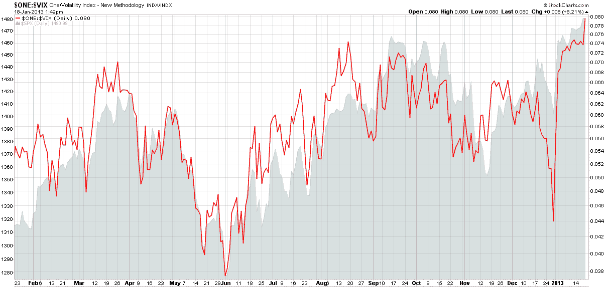

<!--yml

分类：未分类

日期：2024-05-18 16:19:14

-->

# VIX 和更多：倒置百分位 VIX

> 来源：[`vixandmore.blogspot.com/2013/01/the-inverted-percentile-vix.html#0001-01-01`](http://vixandmore.blogspot.com/2013/01/the-inverted-percentile-vix.html#0001-01-01)

投资者在解读 VIX 时有很多原因会感到困惑，其中最明显的一个问题是定位问题：大部分时间，VIX 与股票的走势相反。坦率地说，除非你花很多时间倒挂着看世界，像蝙蝠一样，否则很难欣赏到一个颠倒世界的某些细微之处。

部分原因是我于 2007 年 8 月创造了**倒置 VIX**([inverted VIX](http://vixandmore.blogspot.com/search/label/inverted%20VIX))。当时，VIX 刚刚在经历了仅两个月交易在 12s 后 spike 进入 20s。下面的图表是倒置 VIX 过去一年的更新版本，表明大部分时间，SPX 和倒置 VIX 跟踪得相当接近，尽管有时，例如在[财政悬崖](http://vixandmore.blogspot.com/search/label/fiscal%20cliff)解决之前，VIX 有时会走出自己的路。

*[来源：StockCharts.com]*

今天，我们看到的 VIX 大约为 12.50——自 2007 年 6 月以来该指数最低——投资者再次为找到适当的背景而困惑。让我抛出一个新概念进入混局，或许有所帮助：**倒置百分位 VIX**([inverted percentile VIX](http://vixandmore.blogspot.com/search/label/inverted%20percentile%20VIX))，这是倒置 VIX 的远亲。要考虑倒置百分位 VIX，就要从 VIX 值的寿命来看，其中 12.50 的 VIX 位于 12.2 的百分位。它的倒数是 87.8 的百分位，对应的 VIX 为 28.67。我现在猜测，对大多数投资者来说，12.50 的 VIX**感觉**比 28.67 的 VIX 感觉要低得多。从统计学上讲，它们在作为异常值方面几乎相同，所以如果 28.67 的 VIX 听起来不是一个可怕的高数字，那么 12.50 的 VIX 也不应该听起来像一个反映过于自满的可怕低数字。

投资者可能希望考虑调整他们的情绪和期望，或者，如果失败了，利用相对较低的 VIX 通过购买一些 VIX 看涨期权，以便当世界其他地方意识到 12s 的 VIX 使他们过于紧张时获利。然而，请记住，当前 SPX 的 10 日[历史波动率](http://vixandmore.blogspot.com/search/label/historical%20volatility)在 5s 左右，所以这个数字要想翻倍才能支持 VIX 目前的水平。

相关文章：

***披露(s):*** *无*
