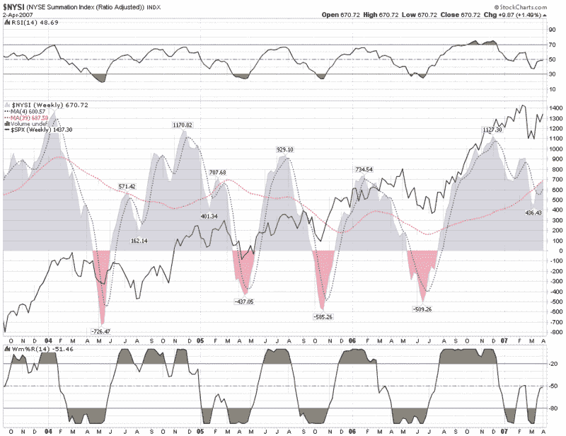

<!--yml

category: 未分类

date: 2024-05-18 15:51:09

-->

# VIX and More: 麦考利兰总和指数

> 来源：[`vixandmore.blogspot.com/2007/04/mcclellan-summation-index.html#0001-01-01`](http://vixandmore.blogspot.com/2007/04/mcclellan-summation-index.html#0001-01-01)

麦考利兰总和指数以其创始人命名，[舍曼和玛丽莲·麦考利兰](http://www.mcoscillator.com/about.html)，他们在 1969 年开发了这个指标。这个指数及其对应物，麦考利兰振荡器，是评估市场广度（上涨股票减去下跌股票）趋势的工具，应该每个投资者工具箱里都有。

总和指数和振荡器都源于相同的一组计算，振荡器数据以更适合短期和中期交易的方式呈现，而总和指数则旨在识别长期趋势的变化。关于具体计算的详细讨论，请参见

[DecisionPoint](http://www.decisionpoint.com/TAcourse/AboutMcOsi.html)

or

[Stockcharts.com](http://stockcharts.com/school/doku.php?id=chart_school:technical_indicators:introduction_to_mark#mcclellan_summation_)

.

使用这个指标时，我更倾向于从更长远的角度看待市场，因此我在下面 included 了一张自 2003 年以来的麦考利兰总和指数（也被称为纽约证券交易所总和指数）的周线图。图表显示，在从 2002 年低点反弹的行情中，总和指数在市场转折前出色地预测了高点和高点，对市场高点有 2-3 个月的预警，而对低点的预警期则更短。同时注意，这些高点和低点在过去几年中倾向于落入 7-12 个月的周期模式。

我的想法是，当一个指标有效时，要坚持使用它，特别是如果它擅长预测市场转折。

至于当前的总和指数读数以及它对第二季度及以后市场的预示，总和指数正好位于 39 周 SMA 的事实告诉我，我们更有可能在短期内波动，而不是急剧上升或下降。

记住，我们都站在巨人的肩膀上；对这些巨人了解一点是有好处的。

 *[source:  StockCharts.com]*
