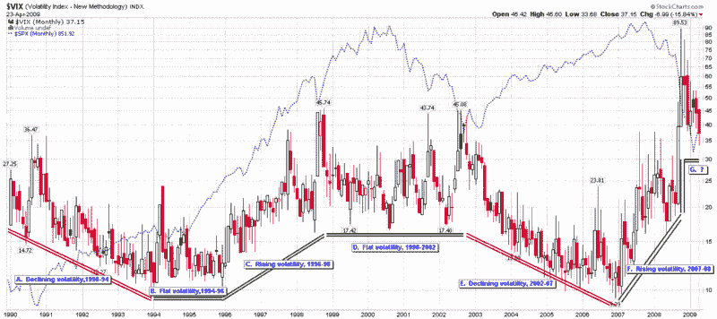

<!--yml

分类：未分类

日期：2024-05-18 17:50:41

-->

# VIX 和更多：新的 VIX 宏观周期图

> 来源：[`vixandmore.blogspot.com/2009/04/new-vix-macro-cycle-picture.html#0001-01-01`](http://vixandmore.blogspot.com/2009/04/new-vix-macro-cycle-picture.html#0001-01-01)

自从 VIX 数据诞生以来，追溯到 1990 年，VIX 就显示出一种每 2-4 年波动一次的周期性，我将其称为[VIX 宏观周期](http://vixandmore.blogspot.com/search/label/VIX%20macro%20cycles)。

下面的图表显示了六个不同的 VIX 宏观周期，其中包括波动性下降、上升或稳定的时期。目前我给每个时期分配了一个字母，但某个时刻我可能会回顾并给它们命名，描述期间对波动性的各种影响，并开始建立分类的基础。

今天我的目标要现实得多。目前，我将 2007 年 1 月到 2008 年 11 月确定为最近波动上升时期的官方终点。截至 12 月，我们正处于一个新的 VIX 宏观周期中。尽管这个新波动时代的最初几个月波动性出现了戏剧性的下降，但我怀疑波动性很快就会稳定下来，正如 1994 年和 1998 年的波动高峰带来了一段相对稳定的波动期一样。

从过去的波动高峰中注意到，波动性最初回落到较低水平通常在波动性高峰后持续 4-6 个月。如果这一模式再次重复，那么我预计波动性在接下来的 2-3 周内不会低于新的低点。

猜测波动性会在哪里找到一个新的平台并不容易，但目前我将其设为 30 的一个临时低点。最终，我不会感到惊讶，如果我将低点移至 25-27 的范围之内，但在投资者集体心理和市场能够对塑造未来几年重大事件和政策的各种金融和经济机构感到一定程度的舒适之前，还需要做大量的工作来消除恐惧和波动。

来源：[StockCharts]
