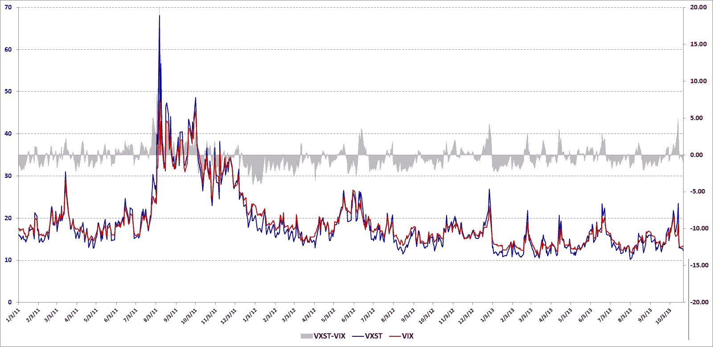

<!--yml

类别：未分类

日期：2024-05-18 16:12:42

-->

# VIX and More: The New VXST and the VXST:VIX Ratio

> 来源：[`vixandmore.blogspot.com/2013/10/the-new-vxst-and-vxstvix-ratio.html#0001-01-01`](http://vixandmore.blogspot.com/2013/10/the-new-vxst-and-vxstvix-ratio.html#0001-01-01)

月初，CBOE 风险管理会议在葡萄牙传出几条有趣的消息。其中特别引起我兴趣的是[新 CBOE 短期波动指数](http://ir.cboe.com/releasedetail.cfm?ReleaseID=794060)（[VXST](http://vixandmore.blogspot.com/search/label/VXST)）的发布，它与 VIX 基本相同，不同之处在于，VIX 关注的是 30 个日历日的窗口，而 VXST 衡量的是[标普 500 指数](http://www2.standardandpoors.com/portal/site/sp/en/us/page.topic/indices_500/2,3,2,2,0,0,0,0,0,0,0,0,0,0,0,0.html)（SPX）期权未来 9 个日历日的[隐含波动率](http://en.wikipedia.org/wiki/Implied_volatility)。

这意味着 CBOE 现在有三个不同的指数来衡量 SPX 期权中的隐含波动率预期：

+   9 天（VXST）

+   30 天（VIX）

+   93 天([VXV](http://vixandmore.blogspot.com/search/label/VXV))

VXV 一直是我研究的一个重点，从我对该指数的最初评论以及我在 2007 年 12 月作为指标开创的[VIX:VXV 比率](http://vixandmore.blogspot.com/search/label/VIX%3AVXV)以来。有了新的 VXST，投资者现在有一个更好的工具来衡量波动率预期，以适应适当的时间框架，这些时间框架适合于[周度期权](http://vixandmore.blogspot.com/search/label/weeklys)，预计到年底，这些期权将占所有期权交易的四分之一左右。

VXST 期权的推出开启了一系列全新的可能性，其中最值得注意的是一个[VXST:VIX 比率](http://vixandmore.blogspot.com/search/label/VXST%3AVIX)的指标，它的作用与 VIX:VXV 比率相似。下图并不是 VXST:VIX 比率，而是这两个指数之间的差异。由于 VXST 的历史数据可以追溯到 2011 年初，值得注意的是，在这段时间内，VIX 有大约 61%的时间高于 VXST。通常，在波动性激增时，VXST 的波动幅度远大于 VIX，在 VXST 高于 VIX 的 39%的实例中，大部分发生在波动性较高的时期。

来源：[CBOE, VIX and More](http://vixandmore.blogspot.com/2013/10/the-new-vxst-and-vxstvix-ratio.html#0001-01-01)

我将在稍后的内容中详细介绍 VXST:VIX 与 VIX:VXV 的比较。现在值得注意的是，这些比率在比较[VIX 期货](http://vixandmore.blogspot.com/search/label/VIX%20futures)的[期限结构](http://vixandmore.blogspot.com/search/label/term%20structure)方面有一些优势，因为这些指数关注的是一个固定的时间段，而 VIX 期货的到期日不断变化。

同样值得关注的是，CBOE 的新闻稿中提到：

> *“计划推出 CBOE 和 CBOE 期货交易所（CFE®）的 VXST 周度期权和期货。这些可交易的 VXST 产品的推出日期尚未确定，取决于监管批准。”*

虽然 VIX 产品对交易很有吸引力，但我可以想象 VXST 期权和期货可能会对某些类型的交易者更有吸引力。此外，如果 VXST 期货获得一些动力，我可以预见基于这些产品的 ETP 可能会在某个时候与 VXX 的吸引力相媲美。

换句话说，这可能会轻易成为波动性领域的一个巨大发展。

相关文章：

***披露(s):*** *在撰写本文时做空 VXX；CBOE 是 VIX 和 More 的广告商*
