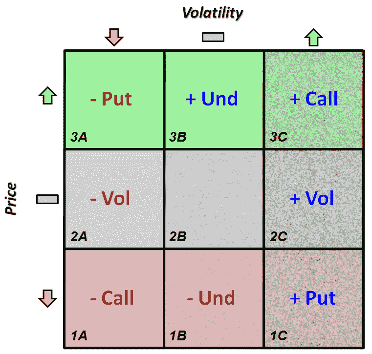

<!--yml

category: 未分类

日期：2024-05-18 17:53:19

-->

# VIX and More: The Options Opportunity Matrix

> 来源：[`vixandmore.blogspot.com/2009/04/options-opportunity-matrix.html#0001-01-01`](http://vixandmore.blogspot.com/2009/04/options-opportunity-matrix.html#0001-01-01)

Maybe I spent too much of my former life in consulting, where [2x2 matrices](http://www.amazon.com/Power-Matrix-Thinking-Decisions-Management/dp/0787972924/ref=cm_cr_pr_product_top) seem to grow wild on PowerPoint slides, but I have always found that a matrix is a useful way to help compare and contrast the tension between conflicting yet sometimes complementary ideas.

我提到这一点是因为最近我回答了几关于我的期权交易方法的问题。在思考我可能想要如何讨论这个话题时，我意识到过去几年里我无意中在脑海中携带了一个 3x3 的期权矩阵。由于我还没有遇到过类似的东西，我认为现在是给这个矩阵起个名字，并将其作为道具来讨论期权策略的好时机。

The graphic below, which I am calling the [Options Opportunity Matrix](http://vixandmore.blogspot.com/search/label/Options%20Opportunity%20Matrix), lays out a portion of my approach.

让我花一分钟解释一下这幅图表。当大多数投资者考虑是否要投资一只股票时，他们对股票的未来价格有自己的看法。他们的价格预测由 Y 轴表示，并且为了方便参考进行了颜色编码。最上面的行是绿色（3A-3C），以反映预期的股价上涨；下面的行是红色（1A-1C），以表示看跌的价格预测；中间的行是灰色阴影（2A-2C），以反映投资者认为股票不太可能显著上涨或下跌的情况。大多数投资者的生活都在最上面的一行，他们只考虑那些有较大价格上涨机会的股票。

尽管期权投资者对价格变动有很强的兴趣，但他们也特别关心波动性的变化。在这里，列和纹理反映了关于未来波动性的观点，1A-3A 列表示预计波动性将下降，纹理更丰富的 1B-3B 列表示波动性不变，而高度纹理的 1C-3C 列反映波动性上升。期权交易员对波动性的变化非常感兴趣，无论是上升（1C-3C）还是下降（1A-3A），因此当他们对某个特定证券的看法落入外侧列时，他们非常乐意开始新的头寸。

实际上，一个对价格和波动率方向有看法的期权投资者应该会乐于在矩阵上的任何九种情景中进行交易，并且在这个过程中为每个框采用不同的策略。这九种情况都适合采用多种策略，但对于投资者来说，只需对每个框中的一个策略感到舒适就足够了。坦白说，一些期权投资者可能会选择只关注这九种情景中的一个，并且可以通过狭窄的专业领域过上不错的生活。

在关于这个主题的后续文章中，我将详细讨论期权机会矩阵策略方法，但在这一部分中，我想确保缩写是清晰的。要解释矩阵，请考虑一个预测价格和波动率都将上升的情景。使用图标和/或颜色和纹理覆盖，注意 3C 单元格建议在这个预测下建立一个长期看涨期权头寸。如果投资者预期价格上涨，但波动率下降，那么 3A 单元格建议出售看跌期权。最后，如果投资者预期价格上涨，但波动率不变，那么 3B 建议是持有基础资产。显然，这些单元格中还有许多替代交易，如价差交易，但这里推荐的是基本交易。

该矩阵还识别出了我所说的波动率交易。波动率交易，如 2C 单元格中的长期波动率交易，最好在预测价格将窄幅波动而波动率上升时执行。所谓的“基本”波动率交易可能是一个短期[straddle](http://vixandmore.blogspot.com/search/label/straddle)，但我个人通常更倾向于一个长期[condor](http://vixandmore.blogspot.com/search/label/condor)交易。

在这个系列的下一部分，我将解释矩阵各种推荐背后的逻辑，并谈论我是如何将这个矩阵背后的想法付诸行动的。

来源：[VIXandMore]
