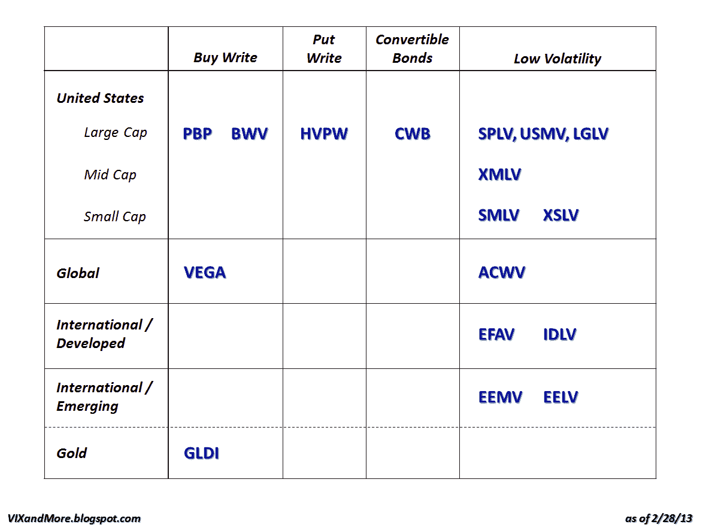

<!--yml

category: 未分类

date: 2024-05-18 16:17:51

-->

# VIX and More: 期权和波动率 ETP 概览

> 来源：[`vixandmore.blogspot.com/2013/02/the-options-and-volatility-etps.html#0001-01-01`](http://vixandmore.blogspot.com/2013/02/the-options-and-volatility-etps.html#0001-01-01)

多年来，我一直发布[VIX ETP](http://vixandmore.blogspot.com/search/label/VIX%20ETN)景观的图形概览，所有 ETP 根据杠杆和目标到期日进行绘图，如最近的[2012 年 VIX ETP 回报](http://vixandmore.blogspot.com/2013/01/vix-etp-performance-in-2012.html)。

然而，最近，越来越多的期权和波动率 ETP 正在一个更接近 VIX 产品而不是其他 ETP 的空间中扎根。我昨天在[超越 SPLV：低波动率 ETP 的扩展宇宙](http://vixandmore.blogspot.com/2013/02/beyond-splv-expanding-universe-of-low.html)中详细讨论了低波动率 ETP。

下图是这些证券的图表，其中行包括它们的地理、市值和资产类别，列包括策略/方法。我在这个领域谈论过[PBP](http://vixandmore.blogspot.com/search/label/PBP)，特别感兴趣的是看到[买入并写](http://vixandmore.blogspot.com/search/label/buy-write) / [覆盖式期权](http://vixandmore.blogspot.com/search/label/covered%20calls)方法现在被应用于黄金，形式为最近推出的[GLDI](http://vixandmore.blogspot.com/search/label/GLDI)。

今天方法的一部分是 U.S. Equity High Volatility Put Write Index ETF ([HVPW](http://vixandmore.blogspot.com/search/label/HVPW))的推出，这是市场上第一个[写期权](http://vixandmore.blogspot.com/search/label/put-write) ETP。我在此详细讨论过写期权策略以及 CBOE S&P 500 PutWrite Index ([PUT](http://vixandmore.blogspot.com/search/label/PUT)))，并在下面包含一些链接供进一步阅读。

在可转债领域，[CWB](http://vixandmore.blogspot.com/search/label/CWB)在过去几年中一直是这个领域最受欢迎的 ETP。本周早些时候，PowerShares 关闭了其竞争的可转债证券组合 ETF (CVRT)，基本上现在将这个领域让给了 CWB。

下图的另一部分是我试图将昨天的大部分文本翻译成一种更方便参考的格式。

我将继续关注所有这些 ETP，并特别关注 HVPW 和 GLDI 在风险调整表现和投资者接受度方面的表现。我当然希望投资者发现这些产品不要像他们接受[ZIV](http://vixandmore.blogspot.com/search/label/ZIV)一样花很长时间。

Related posts:

**披露声明：** *在撰写本文时 PBP 很长*
