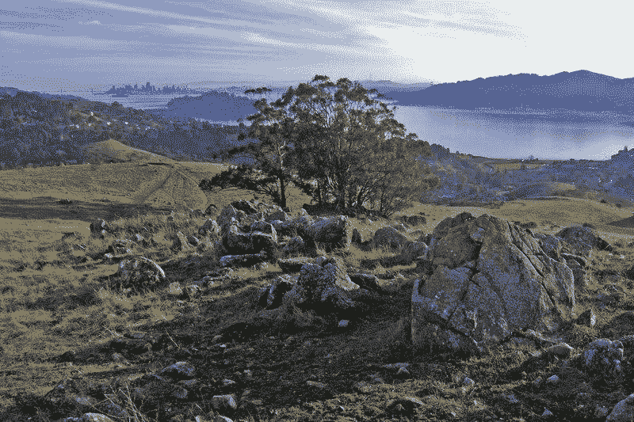

<!--yml

分类：未分类

日期：2024-05-18 18:53:50

-->

# VIX and More: The Other Bubble

> 来源：[`vixandmore.blogspot.com/2007/11/other-bubble.html#0001-01-01`](http://vixandmore.blogspot.com/2007/11/other-bubble.html#0001-01-01)

我已经访问了 47 个州（除了北达科他州、阿肯色州和俄克拉荷马州），比大多数人看到的这个国家还要多，所以当我看到最近一直在流传的各种抵押品赎回权和[次贷地图](http://images.google.com/images?svnum=10&um=1&hl=en&safe=off&client=firefox-a&rls=org.mozilla%3Aen-US%3Aofficial&q=subprime+map&btnG=Search+Images)时，很容易想象出许多这些地方以及沿途遇到的居民。

另一方面，我住在<城市 st="on">旧金山</城市>北面的[马林县](http://en.wikipedia.org/wiki/Marin_County,_California)，在许多方面，这里的房地产价值、可支配收入、态度、政治等方面都像生活在完全不同的泡沫中。  在当地的房地产市场，300 万美元左右的首套住房并不罕见。  作为额外的参考，几年前我和妻子看过的当地一套 850 万美元的房子没有私人主卧室，并且需要相当多的维修。

尽管[Marin Real Estate Bubble](http://marinrealestatebubble.blogspot.com/)博客预测了房地产市场的情况，但当地的房地产市场出人意料地保持了韧性。  [Marin Real Estate Report](http://www.westbayre.com/report_marin.html)追踪了各种房地产数据，并附有下面的图表，显示过去七年，房地产价格至少在季节性趋势调整后一直稳步上涨。  在其他加利福尼亚州的部分地区，情况则不同，正如[圣地亚哥的类似数据](http://rereport.com/sdc/main_csd.html)所显示的，但是至少到目前为止，Marin 房地产泡沫似乎仍然保持完整。
