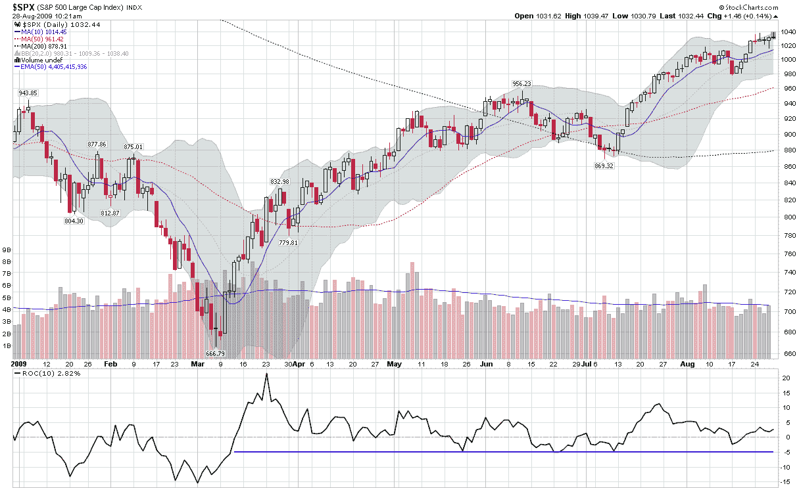

<!--yml

分类：未分类

date: 2024-05-18 17:31:49

-->

# VIX 和更多：恐惧和恐慌的另一面

> 来源：[`vixandmore.blogspot.com/2009/08/other-side-of-fear-and-panic.html#0001-01-01`](http://vixandmore.blogspot.com/2009/08/other-side-of-fear-and-panic.html#0001-01-01)

乔舒亚·布朗在[The Reformed Broker](http://thereformedbroker.com/)上发表了这篇今晨的文章（感谢[Trader Mike](http://tradermike.net/)的提示），标题很有趣，叫做[恐慌性买入的五个阶段](http://thereformedbroker.com/2009/08/27/the-five-stages-of-panic-buying/)。布朗通过引用投资管理世界的名言，为当前牛市的心理历程重建了某种历史。无论是多头还是空头，都鼓励点击查看投资者在过去 5-6 个月里头脑中发生的事情。

五个阶段的背后主题是，在华尔街，年度奖金通常是根据相对于基准的表现来分配的，投资经理们非常讨厌年初落后于基准，并不得不在余下的时间里追赶基准。特别是在市场开始下跌然后急剧反转上升的年份，大多数人可能会发现自己追逐业绩，变得更加积极，承担更多风险，以赶上基准。

当然，恐慌性买入并不是恐慌性卖出的反面。恐慌性买入倾向于使用更多的衍生品、更多的杠杆、更多的贝塔和更少的现金。它在图表上表现为在大盘下跌时的积极买入，股票未能回补早期涨幅等，这也是自反弹开始以来，图表下方的 10 日[变化率](http://vixandmore.blogspot.com/search/label/rate%20of%20change)（ROC）尚未降至-5%（以下）以下的原因之一。

我发现特别有趣的是，我相信恐慌性买入更有可能导致拥挤的交易，并最终导致恐慌性卖出。在我们看到标普 500 指数大幅下跌的日子并不多，自 3 月份底部以来股票市场确实没有出现持续的弱势，但我怀疑当市场最终转向时，那些同样的恐慌性买家会迅速锁定收益，希望与或最终超过适当的基准。

所以……如果我们有很多追逐业绩的恐慌性买家，他们持有的多头头寸的内在价值值得怀疑，那么在未来一个月或几个月里，市场波动性高的交易潜力可能比最近的股市活动所暗示的要高。

*[图表：StockCharts]*
