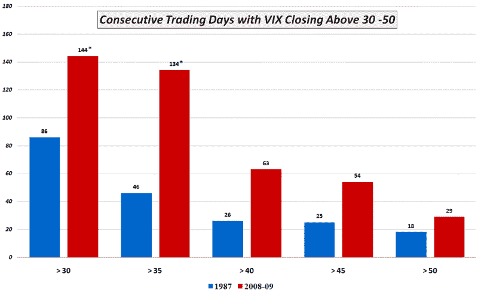

<!--yml

分类：未分类

日期：2024-05-18 17:52:39

-->

# VIX and More: The Persistence of Volatility

> 来源：[`vixandmore.blogspot.com/2009/04/persistence-of-volatility.html#0001-01-01`](http://vixandmore.blogspot.com/2009/04/persistence-of-volatility.html#0001-01-01)

我经常认为，萨尔瓦多·达利的[记忆的持久](http://en.wikipedia.org/wiki/The_Persistence_of_Memory)，其著名的融化时钟，应该是所有期权交易员的官方画作，因为如果有什么东西会扭曲时间，那就是期权交易员的位置和心态的狂野变体。

随着 VIX 今日收盘于 36.53，自 9 月 26 日以来最低收盘价，波动性和时间似乎再次发生了扭曲。在数周围绕 40 水平波动之后，VIX 似乎终于朝着雷曼兄弟破产前的水平方向发展。

持续六个月半的波动性让我想到，现在是很好的时机来比较 2008-2009 年的波动性趋势与记录上唯一的另一段高隐含波动性时期，即[1987](http://vixandmore.blogspot.com/search/label/1987)年的股灾。

下图表示了 1987 年的[VIX 激增](http://vixandmore.blogspot.com/search/label/VIX%20spikes)连续 86 个交易日保持在 30 以上，大约有一个月的时间保持在 40、45 和 50 以上。相比之下，2008-2009 年的金融危机见证了连续三个月（63 个交易日）VIX 保持在 40 以上，并且印象深刻的 134 天和 144 天保持在 35 和 30 以上，这些记录仍在继续。这并不是说 144 天的连续记录变得太长，只是当我们谈论隐含波动性时，我们已深入未知领域。

当然，没有数据回溯到大萧条时期，但 30 天历史波动性，VIX 的一个合理代理，能够在 1931 年 9 月至 1933 年 1 月长达 16 个月的时期内保持在 30 以上。如果 VIX 在阵亡将士纪念日之前一直保持在 30 以上，那将标志着 1931-1933 记录的一半。

*[来源：VIXandMore]*
