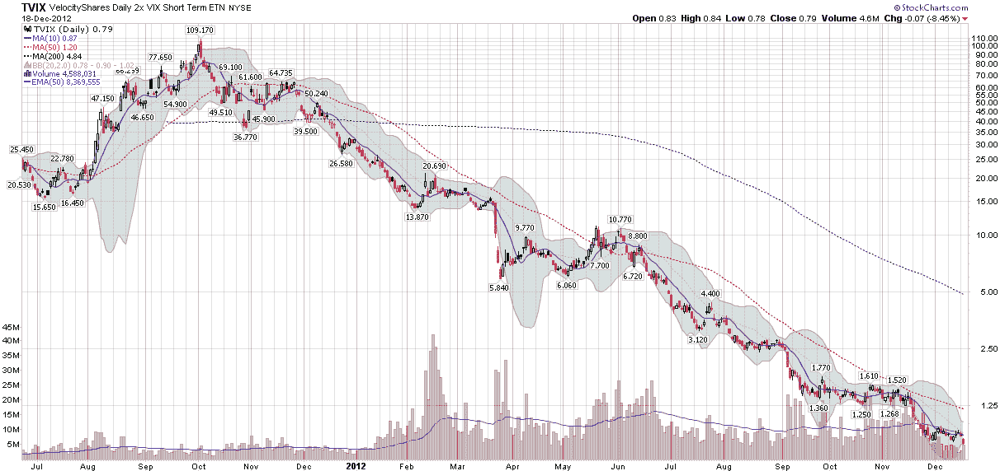

<!--yml

分类：未分类

日期：2024-05-18 16:20:46

-->

# VIX and More: TVIX 的复活

> 来源：[`vixandmore.blogspot.com/2012/12/the-resurrection-of-tvix.html#0001-01-01`](http://vixandmore.blogspot.com/2012/12/the-resurrection-of-tvix.html#0001-01-01)

2012 年对 TVIX 来说是非常的一年，它正式被称为 VelocityShares Daily 2x VIX Short-Term ETN。年初时，TVIX 每天的交易量约为一百万股，只被少数关注[VIX 交易所交易产品](http://vixandmore.blogspot.com/search/label/VIX%20ETN)空间的投资者所知。然而，到了 2 月中旬，TVIX 的交易量激增至四千万股，成为 VIX ETP 领域的成交量领导者。似乎 TVIX 以惊人的速度和几乎不费吹灰之力的方式，从相对默默无闻一跃成为引人注目的摇滚明星。

TVIX 很快成为了自己成功的牺牲品，这一事实在 2 月 21 日瑞士信贷（[CS](http://vixandmore.blogspot.com/search/label/CS)）[宣布](http://vixandmore.blogspot.com/2012/02/credit-suisse-suspends-creation-units.html)暂停发行 VelocityShares Daily 2x VIX Short-Term ETNs ([TVIX](http://vixandmore.blogspot.com/search/label/TVIX))之后得到了确认，原因是 ETNs 的内部规模限制。我深入报道了[这个故事](http://vixandmore.blogspot.com/2012/02/credit-suisse-suspends-creation-units.html)及其后果，并且不会在这里重复具体细节（更多详情请查看下面的链接），只是要注意新创设单位的缺失导致了供需之间的巨大不平衡，结果 TVIX 的价格相对于其[盘中参考价值](http://vixandmore.blogspot.com/search/label/intraday%20indicative%20value)（基于其基础证券最近价格的实时估计的 ETP 的公允价值）大幅上涨，并且几乎完全脱离了任何合理的公允价值估计。在极端的价格错位持续了一个多月之后，直到瑞士信贷在 3 月 22 日[同意](http://vixandmore.blogspot.com/2012/03/tvix-creation-units-return-what-it.html)以有限的方式重新开放创设单位的发行。简而言之，在这次宣布之后，价格在两天内下跌了超过 50%（请看图表下面的跳空缺口），许多投资者遭受了巨大损失，随后是一系列诉讼。

*[source(s): StockCharts.com]*

瑞士信贷允许 TVIX 在三月底的价格跌破 10.00，在六月底的价格跌破 5.00，这时我将它从我的雷达屏幕上移除，用一个类似的产品[UVXY](http://vixandmore.blogspot.com/search/label/UVXY)替代，后者有额外的可选择权的好处。当 TVIX 在上个月跌破 1.00 时，我假设瑞士信贷已经将 ETN 判定为一个缓慢而痛苦的死亡。

别急。

在上周五晚些时候，瑞士信贷[宣布](http://finance.yahoo.com/news/credit-suisse-ag-announces-reverse-011500337.html)一个 1-10 的反向分割，于本周五（12 月 21 日）开盘时生效。在今天收盘价为 0.79 的情况下，1-10 的分割会使 TVIX 回升至 7.90，这是 ETN 在六月份的交易水平。

根据这个消息，我只能得出结论，瑞士信贷打算复活 TVIX，这让我感到惊讶，因为 TVIX 的资产仍然比 UVXY 多（1.1 亿美元对比 1 亿美元。）

在我看来，这仍然是一个“为时已晚”的情况。在 7.90 的水平，TVIX 只有一个月的下跌就会跌破大多数经纪人开始对做空设置重要限制的关键 5.00 水平。就时机而言，瑞士信贷在四月份或五月份在哪里，当时 UVXY 从 TVIX 手中夺取了显著的心智和市场份额，如果当时进行反向分割可能就能阻止那种潮流？

我已经将 UVXY 作为我最喜欢的+2x VIX ETP 产品，我现在对一个有活跃期权市场的产品感到很舒服，并且很难找到回到 TVIX 的理由，特别是因为最近 UVXY 的流动性也显著更高。

许多知名的 VIX 爱好者甚至没有意识到 TVIX 正在进行反向分割，这对于瑞士信贷来说可能是一场艰苦的战斗。最终，证明的责任又落在了 TVIX——以及瑞士信贷身上——要说服投资者这个被认为已经死亡的产品值得交易。作为一个从 TVIX 推出那天起就是其热衷追随者并且在其流行之前就开始撰写 TVIX 文章的人，我对这个产品持怀疑态度，但也很想看看 UVXY 和 TVIX 之间的戏剧如何发展。

相关文章：

***披露(s):*** *在撰写本文时做空 UVXY*
