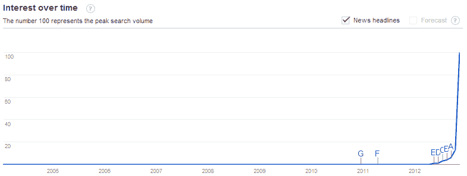
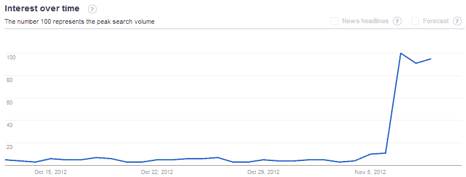

<!--yml

分类：未分类

日期：2024-05-18 16:23:04

-->

# VIX 和更多：财政悬崖担忧的上升

> 来源：[`vixandmore.blogspot.com/2012/11/the-rise-of-fiscal-cliff-concerns.html#0001-01-01`](http://vixandmore.blogspot.com/2012/11/the-rise-of-fiscal-cliff-concerns.html#0001-01-01)

近期股市的大幅下跌有多少是由媒体突然对美国[财政悬崖](http://vixandmore.blogspot.com/search/label/fiscal%20cliff)的痴迷所引发的？有没有可能表面几乎没有变化，但这个问题相关的分贝现在已经爆表？

在过去的三周里，**VIX 和更多** [恐惧调查](http://vixandmore.blogspot.com/search/label/Fear%20poll)的受访者将围绕美国财政悬崖的问题视为他们对股市未来最大的担忧来源。现在选举已经结束，业绩季节也在收尾，这些担忧得到了媒体大量关注突然增加的支撑。

财政悬崖是那些已经几个月悬而未决的问题之一，但投资者们最近才开始关注这个问题。突然对财政悬崖产生兴趣的部分原因是，国会和奥巴马政府在竞选期间不会解决财政悬崖问题，因此在这段时间里没有人预期会在这个问题上取得任何进展。现在选举已经结束，这个问题被视为一个定时炸弹，每天导火索都变得更短。

尽管全球的政治家、经济学家和商界领袖都呼吁民主党和共和党就财政悬崖问题迅速达成解决方案，但备受尊敬的国会预算办公室周四发布了两个新文件，为对话增添了新的紧迫感：

1.  2013 年政策对财政紧缩的经济影响](http://www.cbo.gov/sites/default/files/cbofiles/attachments/11-08-12-FiscalTightening.pdf)

1.  [减少赤字的选项](http://www.cbo.gov/sites/default/files/cbofiles/attachments/43692-DeficitReduction_print.pdf)

我不得不说我并没有太多关注 CNBC 和彭博电视这样的媒体，但我知道现在财政悬崖问题也占据了商业电视节目的主导地位。

所有这些都让我想知道近期股市的大幅下跌有多少是由实质内容驱动的，有多少是由媒体狂热驱动的。

我查看了[谷歌趋势](http://vixandmore.blogspot.com/search/label/Google%20Trends)关于“财政悬崖”的数据，并发现这个问题直到今年五月前在谷歌的雷达上几乎没有存在感。

来源：[Google 趋势](http://vixandmore.blogspot.com/search/label/Google%20Trends)

直到上周日，偶尔会提到财政悬崖，然后在周一，也就是美国大选前一天，对这一主题的新兴趣开始浮现。对于财政悬崖兴趣的大幅上升发生在选举后的第二天，当时“财政悬崖”的谷歌搜索量增加了十倍，媒体狂热也随之开始。

*[来源：Google 趋势]*

周末期间，关于财政悬崖的担忧([outpolling](http://vixandmore.blogspot.com/2012/11/weekly-vix-and-more-fear-poll.html)投票仍在进行中)已经超过了对于持续中的[欧洲主权债务危机](http://vixandmore.blogspot.com/search/label/European%20sovereign%20debt%20crisis)的担忧，这是迄今为止最大的差距。真正的问题在于，这是否主要是由于媒体和投资者注意力的转移，还是由于问题的本质特征发生了变化，或者是有望及时解决这一问题。我猜测前者起到的作用比后者大。

相关文章：

***披露：*** *无*
