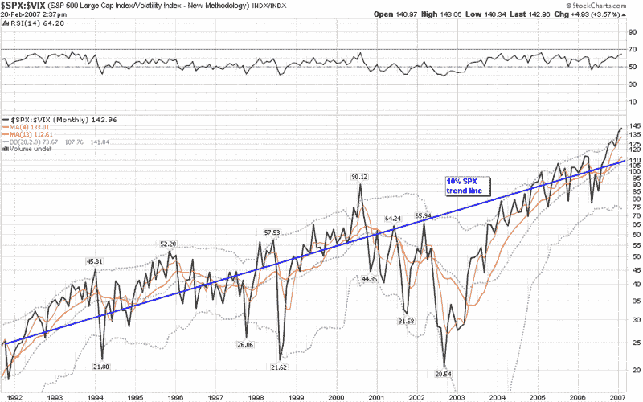

<!--yml

分类：未分类

日期：2024-05-18 15:58:28

-->

# VIX and More: SPX:VIX 关系

> 来源：[`vixandmore.blogspot.com/2007/02/spxvix-relationship.html#0001-01-01`](http://vixandmore.blogspot.com/2007/02/spxvix-relationship.html#0001-01-01)

在过去的几个月里，在[Technically Speaking](http://ronsen.blogspot.com/)上对 SPX:VIX 比率给予了相当[突出的地位](http://ronsen.blogspot.com/search?q=SPX%3AVIX)，Ron Sen 问道，SPX:VIX 比率图是否有效地作为一个风险指标发挥作用。

许多人似乎最近对 VIX 失去了信心，但 SPX:VIX 比率是一个特例。这个比率的问题之一是它将一个趋势数字与另一个振荡的数字进行比较。使用 Ibbotson 数据作为指导，我们可以假设——至少在长期内——SPX 的年回报率应该约为 10%，而 VIX 应该围绕一个稳定的均值振荡。有趣的是，如果你在 1991 年以来的 SPX:VIX 比率图表上添加一条 10%的趋势线以补偿这一点，你会发现 15 ½ 年后，趋势线几乎完美地将当前的 Bollinger 带分割开来。

如果你仔细研究这张图表一段时间，一些有趣的结论就会浮现：

+   除了互联网泡沫破裂的后半段和亚洲金融危机，SPX:VIX 比率很少远离 10%趋势线所预测的值

+   自 2004 年以来，SPX:VIX 比率一直紧紧靠近 10%的趋势线

+   当前趋势线以上的偏差只有在 2000 年中期、1994 年初和 1995 年末才出现过，这三个时期分别标志着深度熊市、温和熊市和强劲牛市的开始

我认为 SPX:VIX 比率确实是一个有用的风险指标，但我建议以一种能够弥补股票长期看涨偏见的方式使用它，或者主要关注相对高峰和低谷。

目前，我认为 SPX:VIX 比率正在发出轻微的警告信号，但最终你对比率的态度可能更多地取决于你对 VIX 历史低位和 SPX 历史高位的理由的看法。
