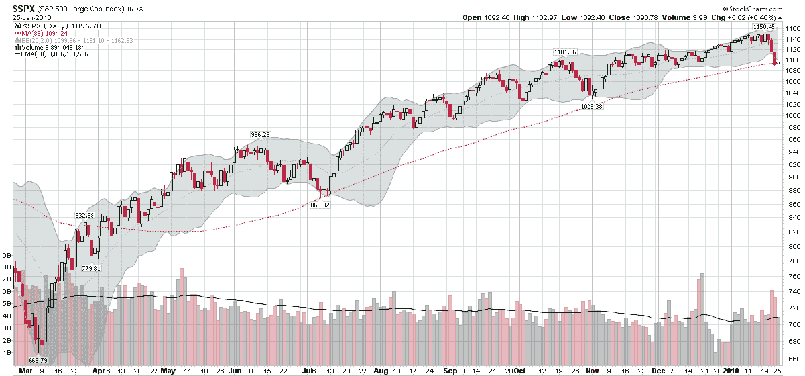

<!--yml

分类：未分类

日期：2024-05-18 17:17:23

-->

# VIX 和更多：标普 500 和 85 天移动平均线

> 来源：[`vixandmore.blogspot.com/2010/01/spx-and-85-day-moving-average.html#0001-01-01`](http://vixandmore.blogspot.com/2010/01/spx-and-85-day-moving-average.html#0001-01-01)

在 11 月初，我在[图表一周：逆向工程关键移动平均线](http://vixandmore.blogspot.com/2009/11/chart-of-week-reverse-engineering.html)一文中谈到了能够“开发定制的移动平均线，以限定过去的价格行动，从而更好地理解当前对股价的作用力与过去的作用力如何相比”的重要性。

在审视了各种优化移动平均线的方法（至少是事后的看法）之后，我得出结论，标普 500 指数的 85 天移动平均线在 2009 年 3 月至 10 月期间是对支撑水平的优秀近似。

快进到 2010 年 1 月，当前的市场回调刚刚在周五触及了 85 天移动平均线以下，并在今天收盘时收于该水平之上。至少到目前为止，85 天移动平均线是图表上可以找到的支撑的最好指标之一。在我下一篇文章中，我将详细介绍我认为对移动平均线方法的一个有意义的改进。

关于相关主题的更多信息，读者们被鼓励去查阅：

*[来源：StockCharts]*

***免责声明：*** 无
