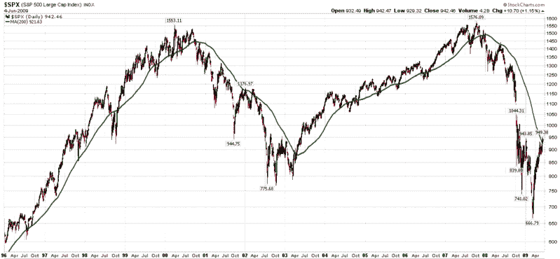
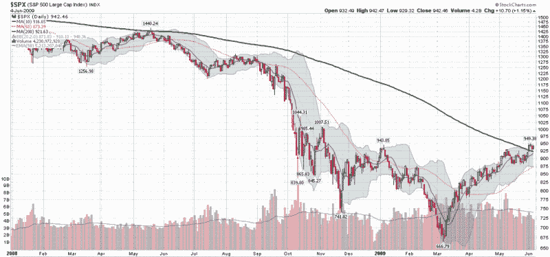

<!--yml

category: 未分类

date: 2024-05-18 17:44:25

-->

# VIX and More: The SPX and the 200 Day Moving Average

> 来源：[`vixandmore.blogspot.com/2009/06/spx-and-200-day-moving-average.html#0001-01-01`](http://vixandmore.blogspot.com/2009/06/spx-and-200-day-moving-average.html#0001-01-01)

最近，有关标普 500 指数首次自 2007 年底以来收于其 200 天移动平均线之上的讨论很多。

交易者首先应该问自己的问题是，这个技术性工具是否与交易相关。简单的答案是，这取决于多少人关注 200 天移动平均线，并在其交易方法中纳入了与之相关的规则。例如，有许多交易者喜欢——或坚持——当所涉及的工具在其 200 天移动平均线之上时，仅持有多头头寸，而在其低于 200 天移动平均线时，仅持有空头头寸。总的来说，如果有足够多的人关注 200 天移动平均线，它就会成为一种某种程度上自我实现的预言。

但是将 200 天移动平均线纳入交易决策是否具有优势？Condor Options 今天稍早曾在 [Exponentially Curb Your Enthusiasm](http://www.condoroptions.com/index.php/market-commentary/exponentially-curb-your-enthusiasm/) 中讨论过这个话题，并得出结论称，自 1965 年以来，只有将 200 天简单移动平均线（SMA）和指数移动平均线（EMA）纳入长期策略的交易者，才能击败简单的买入持有方法。（有趣的是，EMA 方法的表现优于 SMA 方法。）

仔细回顾一下长期标普 500 指数图表，就能看到 200 天移动平均线如何帮助产生出色的定时信号。请注意，从 1996 年到 2000 年和 2003 年到 2007 年，200 天移动平均线几乎一直保持投资者处于牛市中。从 2000 年到 2003 年的熊市以及从 2008 年初至今，投资者将会持有现金（或甚至可能持有空头头寸）。

从 2008 年初开始观察标普 500 指数，人们可以看到 200 天移动平均线的稳步下降，实际上在 2008 年 1 月达到了顶峰。

在对 200 天简单移动平均线（200 day SMA）过于兴奋之前，重要的是要仔细研究计算所需的数据。现在，200 天的时间窗口包括数据追溯到 2008 年 8 月 19 日，当时标普 500 指数（SPX）收于 1266.69。明天，这个数字将从计算中删除，并用一个接近今天收盘价 942.46 的数字来替换。这意味着从指数计算中丢失了 324 点，这意味着如果市场横盘，200 天 SMA 将以每天约 1.6 点的速度下降，因为从 8 月份以来的较高收盘价已经滚动掉了。事实上，自 2009 年初以来，过去五个月中，200 天 SMA 分别下降了 48、46、69、46 和 37 点。

另一个需要考虑的因素是，3 月 6 日和 9 日低点现在已经几乎落在了我们身后三个月。这意味着分别是 61 和 62 个交易日。这也说明，3 月的低点将在 38 到 39 个交易日后位于数据序列的中点，这意味着 200 日简单移动平均线最有可能会在 7 月底的最后一周之前继续下降然后转而上行。

所以，不妨将 200 日简单移动平均线视为潜在支撑水平或长/短线转折点，但展望未来，图表中的这条线应继续下降且越来越不相关，除非市场当然跟随绿色线条下行。

图示：股票图表
