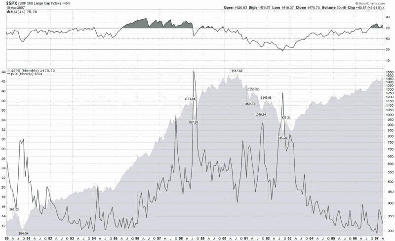

<!--yml

分类：未分类

日期：2024-05-18 15:48:39

-->

# VIX 和更多：标普 500 和 VIX 再探讨

> 来源：[`vixandmore.blogspot.com/2007/04/spx-and-vix-revisited.html#0001-01-01`](http://vixandmore.blogspot.com/2007/04/spx-and-vix-revisited.html#0001-01-01)

几位读者询问，如果 VIX 远低于历史低点，市场是否还能继续创新高。我的回答是：“绝对可以！”坦白说，我期望市场宽指数的新高只会偶尔与 VIX 的新低相对应。

我将在下面阐述我的想法，但在详细说明之前，让我提个问题。假设我告诉你，我瞥见了未来，并可以保证到 2050 年标普 500 指数将交易在 100,000 点。现在我请你猜猜当标普 500 达到这个里程碑时 VIX 将会是多少。你猜的是多少？10？11？我猜可能是 18 或 19，因为自 1990 年以来 VIX 的日均收盘价的中位数是 18.95。记录在案，这个 100,000 的数字也并不那么疯狂，因为它代表的是“仅”10.1%的复合年增长率（CAGR），这与历史回报率一致。

这里的大问题，正如我在文章《The SPX:VIX Relationship》中详细讨论的，我们试图比较一个长期趋势大约每年 10%的数字与另一个围绕约 19 的平均值振荡的值。

让我调出标普 500 和 VIX 自 1990 年以来的月度图表来说明我的观点（点击可查看更大图片；如果您愿意，也可以点击任何预览图片的右上角禁用 Snap 预览功能）：

仔细观察 1994 年 10 月至 2000 年 3 月的时期，当然，这是一个狂热的牛市，标普 500 指数增加了大约 4.5 倍，并创下了数百个新的历史高点。许多人可能没有意识到，在这段时间内 VIX 也在稳步上升，从 12-14 的范围上升到 20 多。事实上，考虑到 VIX 的振荡性质，应该预期在许多看涨时期 VIX 实际上会横盘整理或上升。只有在极端的看涨自满情绪下，我们才应该期望看到 VIX 读数在 11-12 范围内，低于 10 可能会变成十年一次的现象。换句话说：本世纪内我们很可能不会看到 VIX 低于 8，然而在本世纪末，标普 500 指数有可能会有 39 个数字。

关于当前 VIX 和市场指数的状态，还需要考虑的一个因素是[回声波动性](http://vixandmore.blogspot.com/search/label/echo%20volatility)，我过去在这里详细讨论过。虽然一些购买股票的人可能觉得大的波动性激增已经过去了，但其他人，[比如我的狗](http://vixandmore.blogspot.com/2007/01/what-my-dog-can-tell-us-about_947.html)，坚信波动性聚集——有充分的理由。

总之，[时间跨度](http://vixandmore.blogspot.com/search/label/time%20horizon)很重要，但更重要的是要知道何时你在将趋势性数字与摆动性数字进行比较。为了解决 SPX-VIX 难题的一个潜在方案，你可能想看看我关于[SPX:VIX](http://vixandmore.blogspot.com/search/label/SPX%3AVIX)比率的先前帖子。
