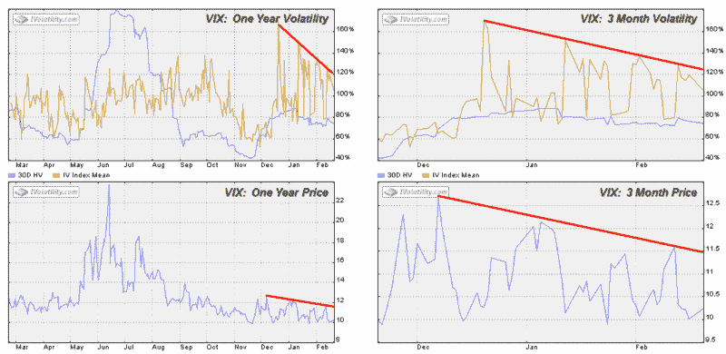
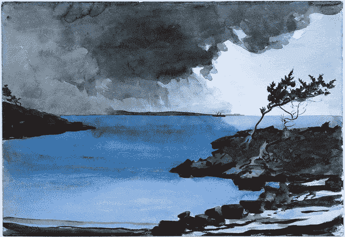

<!--yml

分类：未分类

日期：2024-05-18 15:58:17

-->

# VIX and More: The Shape of Capitulation in the VIX?

> 来源：[`vixandmore.blogspot.com/2007/02/shape-of-capitulation-in-vix.html#0001-01-01`](http://vixandmore.blogspot.com/2007/02/shape-of-capitulation-in-vix.html#0001-01-01)

VIX 是一种奇怪的动物；既然我刚刚开始在这个领域担任动物学家，我对这个生物的许多基本问题还没有答案。其中最基本的问题是，是否对 VIX 采用图表分析方法是有效的。我利用图表做其他一切事情，但我还没有开发出一套我认为对波动率指数具有预测价值图表。然而，我不会让这个小细节阻止我…

在观察 VIX 图表时，我特别好奇 12 月中旬的低点和随后的隐含波动率的大幅上升。如下图所示，当 VIX 下跌并引发波动率上升时，随后的波动率上升一次比一次弱。

实际上，过去两个月里，VIX 和 VIX IV 似乎都受到了某种无形下行趋势的限制。如果这是真的，那么图表似乎想让我们相信 VIX 既不会上涨也不会下跌。从实际出发，波动率看起来准备稳定在 10-11 的范围内，是时候给我博客换个名字了。当然，[至少有一个 VIX 观察者在三年前就说过类似的话](http://www.zealllc.com/2004/nofear.htm)。

我的看法是，我们所看到的是 VIX 投降形态的迹象。当然，VIX 不仅仅是一个逆向指标，它是一只逆向的动物，以至于在这个案例中的投降并没有像其他许多指标那样出现剧烈的波动和大成交量。不，VIX 的投降就像一个风平浪静的池塘。至少现在是这样。我不会这么快就收起帆船。
