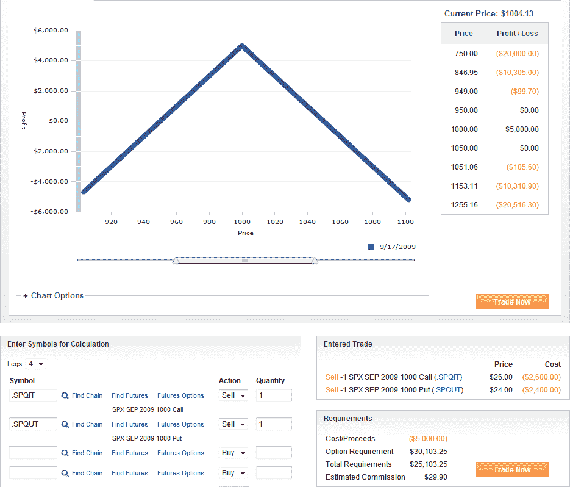
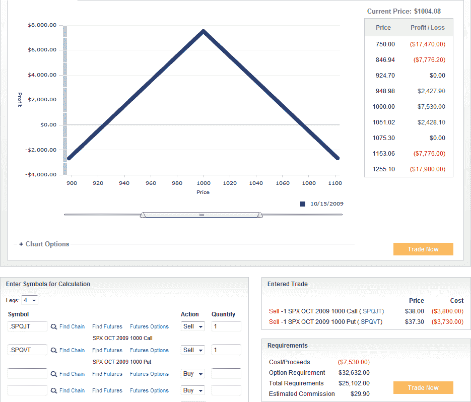

<!--yml

类别：未分类

日期：2024-05-18 17:33:01

-->

# VIX 和更多：横盘交易

> 来源：[`vixandmore.blogspot.com/2009/08/sideways-play.html#0001-01-01`](http://vixandmore.blogspot.com/2009/08/sideways-play.html#0001-01-01)

市场中的极端看涨者和看跌者越多，我开始越关注市场可能出现横盘整理的可能性。像往常一样，看涨者和看跌者都可以提出有力的论据来支持他们的立场——甚至用一套令人信服的事实来支持他们。

从技术角度来看，虽然 SPX 从底部反弹了超过 50%，但在上涨过程中几乎没有多少回调。

所以现在我们坐在 SPX 1004 的位置，主要平均指数刚刚略低于近期高点，而 8 月份的 SPX 期权明天开盘时即将到期。然而，自 SPX 在 2009 年创下的 1018 高点以来，已经过去了九个交易日。最后，虽然波动率一直在下降，但 VIX 似乎在 24-25 区间找到了一个地板。

考虑到这些因素，我正在认真考虑出售一些 SPX[横盘交易](http://vixandmore.blogspot.com/search/label/straddle)。下面的图表显示，单个合同的 SPX 9 月 1000 点空头横盘交易（顶部图表）最大潜在利润为 5000 美元，利润区间在 950 到 1050 点之间。对 SPX 10 月 1000 点空头横盘交易（底部图表）感兴趣的交易者有另外大约 50%的最大潜在利润（7530 美元）和 50%更宽的利润区间（从 925-1075 点）。

空头横盘交易在市场横盘变动且波动率([vega](http://www.optionstradingbeginner.blogspot.com/2007/06/option-greeks-vega.html))下降时表现最佳。

当然，当空头交易出错时，它们可能会迅速变得难看，所以任何想要进入空头横盘交易的人都应该期望密切监控这个交易，并提前制定好各种退出策略。

风险厌恶感更强的交易者肯定会感兴趣的是检查[蝴蝶](http://vixandmore.blogspot.com/search/label/butterfly)交易而不是横盘交易。

对于这些主题的更多文章，读者们可以查阅：

……以及两个部分的 SPX 空头横盘交易案例研究：

1.  [SPX 是否会守住 900 附近？](http://vixandmore.blogspot.com/2008/12/is-spx-going-to-stick-close-to-900.html)

1.  [SPX 横盘交易案例研究更新](http://vixandmore.blogspot.com/2008/12/spx-straddle-case-study-update.html)

*[图表：optionsXpress]*
