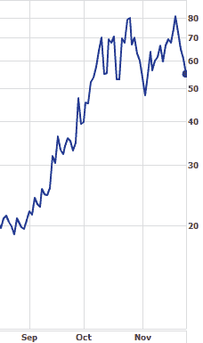
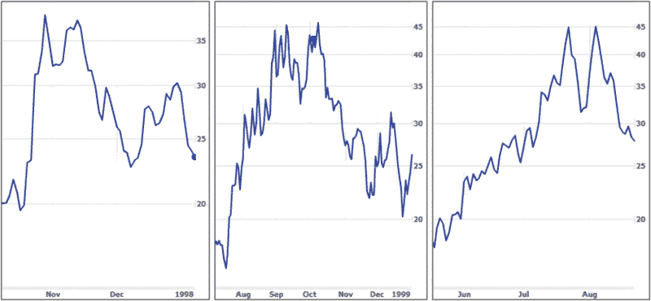

<!--yml

类别：未分类

日期：2024-05-18 18:12:12

-->

# VIX 和更多：VIX 双顶形成的意义

> 来源：[`vixandmore.blogspot.com/2008/12/double-tops-in-vix.html#0001-01-01`](http://vixandmore.blogspot.com/2008/12/double-tops-in-vix.html#0001-01-01)

以下内容改编自[订阅者通讯](http://vixandmoresubscriber.blogspot.com/)的一个段落，该段落出现在 11 月 26 日的通讯中。

 我从未看到过关于 VIX 双顶主题的研究，但考虑到 VIX 最近的双顶形成，我认为现在是分享我对这个话题的一些思考的好时机。首先，右侧的图表显示了从 8 月中旬至今的 VIX 水平。双顶的第一次突刺出现在 10 月 24 日，最近的突刺出现在 11 月 19 日。

VIX 数据 19 年的历史中，双顶在历史上相当常见，并且经常与 VIX 的极端读数同时出现。相比之下，VIX 三重顶相对罕见；而在更为平淡的市场条件下，单一的 VIX 突刺很常见，但在 VIX 极端情况下，它们不如双顶常见。

实际上，在今年的前三名危机中，VIX 读数最极端的三次危机分别是 1997 年的[亚洲金融危机](http://vixandmore.blogspot.com/search/label/Asian%20financial%20crisis)、1998 年的[长期资本管理危机](http://vixandmore.blogspot.com/search/label/Long%20Term%20Capital%20Management)，以及 2002 年伴随[世界通信](http://vixandmore.blogspot.com/search/label/WorldCom)破产申请的科技泡沫破裂底部。在下面的图表中，我记录了这些 VIX 突刺的历史。你可以清楚地看到在所有三次情况下 VIX 都出现了双顶模式。有趣的是，在每次情况下，突刺之间大约相隔 2-3 周，并预示着市场的重大转折点。

近期事件表明，从过去的图表模式推断当前市场充满危险，但我认为 VIX 双顶的出现加强了近期股市底部将成为一个重要的市场转折点的论点。

来源：[雅虎，VIX 和更多](http://yahoo.com/vix-and-more)
