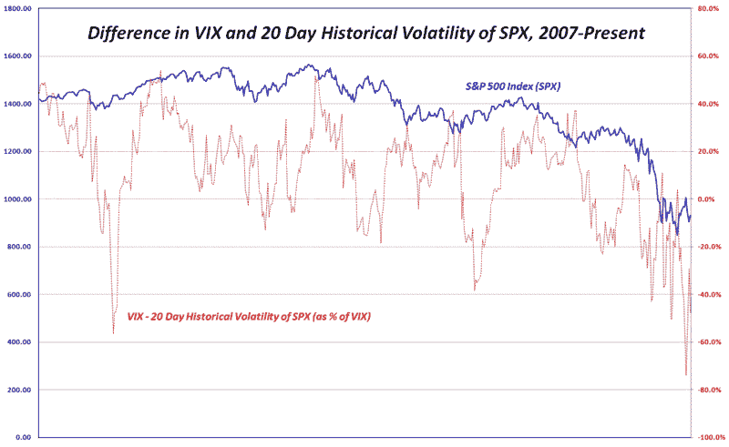

<!--yml

类别：未分类

日期：2024 年 05 月 18 日 18:17:02

-->

# VIX 和更多：VIX 和 SPX 20 天历史波动率之间的差距

> 来源：[`vixandmore.blogspot.com/2008/11/spread-between-vix-and-20-day.html#0001-01-01`](http://vixandmore.blogspot.com/2008/11/spread-between-vix-and-20-day.html#0001-01-01)

在过去几周中，我收到了很多关于我关于 VIX 和[历史波动率](http://vixandmore.blogspot.com/search/label/historical%20volatility)在 SPX 中的帖子的积极反馈。对于那些可能错过的人，你可能希望从[在 SPX 历史波动率的背景下理解 VIX](http://vixandmore.blogspot.com/2008/10/vix-in-context-of-historical-volatility.html)和[VIX – SPX 30 天历史波动率差距和绩效](http://vixandmore.blogspot.com/2008/11/performance-and-vix-and-spx-30-day.html)开始。

今天，SchaeffersResearch.com 的托德·萨拉蒙在他的[星期一晨报帖子](http://www.schaeffersresearch.com/commentary/observations.aspx?ID=89028&c=obsfeed)中观察到： 

> *“我们还从两个角度密切关注芝加哥期权交易所市场波动指数（VIX – 56.10）。首先，VIX 继续以大幅折扣交易，相对于 SPX 的 20 日历史波动率，后者在过去几周略高于 80%。我们对这一情况的解读是，市场对另一次重大挫败的恐惧不大。通常，这种恐惧会导致市场的重大低点。如果恐惧和恐慌加剧，VIX 将会高于 SPX 的实际波动率。”*
> 
> *其次，我们正在关注 VIX 在 44-45 区域的情况。我们认为这个区域很重要，因为它标志着上周的低点，并代表了 VIX 在 10 月 24 日达到的“半高点”。此外，这个区域目前是 VIX 上升的 50 日移动平均线的位置。*

尽管这两个观点都很有趣，但我想在这里评论的是历史波动率的部分。从一些历史开始，自 1990 年以来，VIX 在超过 20 天历史波动率的 SPX 上交易的时间超过 90.6%，通常连续几个月都是如此。因此，VIX 高于 20 天历史波动率实际上并没有多少关于恐惧和恐慌水平的信息。

在下面的图表中，我绘制了 VIX 减去 SPX 20 天历史波动率（以 VIX 的百分比表示）从 2007 年到上周五的情况。从图表中可以看出，当 VIX-HV 高时，这通常会与 SPX 的短期低点相一致。VIX-HV 的低水平不那么容易解读。图表上最引人注目的两个 VIX-HV 低点都发生在 SPX 低点之后，并与 SPX 数个月的上涨趋势相一致。

在当前环境下，我会将周二 VIX-HV 比率创下的历史低点视为一个短期底部正在形成的信号。然而，我不认为 VIX 需要交易在高于标普 500 指数的 20 日历史波动率之上，例如，在 10 月 27 日一天内，以提供任何确认信号。

[来源：VIX and More]
