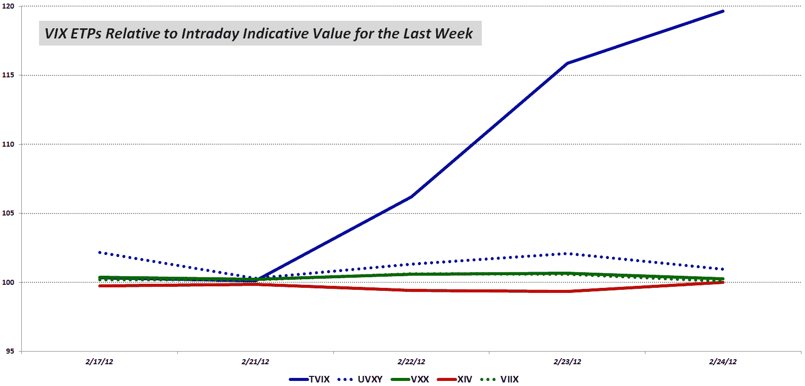

<!--yml

类别：未分类

日期：2024-05-18 16:38:25

-->

# VIX 和更多：VIX ETP 与其盘中指示价值的故事

> 来源：[`vixandmore.blogspot.com/2012/02/story-of-vix-etps-relative-to-their.html#0001-01-01`](http://vixandmore.blogspot.com/2012/02/story-of-vix-etps-relative-to-their.html#0001-01-01)

本周见证了 VIX 交易所交易产品（ETP）空间兴趣的爆炸，这大部分是由于 Credit Suisse（[CS](http://vixandmore.blogspot.com/search/label/CS)）暂停了 VelocityShares 每日 2x VIX 短期 ETNs ([TVIX](http://vixandmore.blogspot.com/search/label/TVIX))的创建单位（想想“新股份”）。

对于那些对故事了解较晚的人以及/或者需要一些背景知识的人，下面的链接应该足够了，但今天我感兴趣的是某些数据，这些数据可能表明 TVIX 股份市场、VelocityShares 除 TVIX 之外的产品以及一种与 TVIX 类似但却是 ETF 而非 ETN 的 ProShares 产品市场压力有多大：ProShares Ultra VIX Short-Term Futures ETF，[UVXY](http://vixandmore.blogspot.com/search/label/UVXY)。

对于此分析，我已经评估了过去一周内少数 VIX ETP 相对于其[盘中指示价值](http://vixandmore.blogspot.com/search/label/intraday%20indicative%20value)（基于其基础证券最近价格的实时估计，是 ETP 的公允价值）的价格。下图显示了五个 VIX ETP 的溢价（相对于其指示价值）百分比，标准化为 100 点刻度。

图表显示，在 2 月 21 日星期二 regular trading 收盘后，TVIX 停止新的创建单位之前，这些 VIX ETP 通常交易于其指示价值非常接近。实际上，对于长期 ETP（TVIX，UVXY，[VXX](http://vixandmore.blogspot.com/search/label/VXX)和[VIIX](http://vixandmore.blogspot.com/search/label/VIIX)）来说，交易于指示价值略微溢价是常态，通常不超过 1%的溢价。相比之下，列表中唯一的反向 ETP [XIV](http://vixandmore.blogspot.com/search/label/XIV)倾向于以略微折价交易于指示价值，同样，通常不超过 1%。

一旦 Credit Suisse 关闭了新的创建单位的大门，TVIX 的价格相对于其指示价值稳步上升，甚至在几分钟前还交易于 20%的溢价。

然而，在其他市场扭曲方面，证据并不令人信服。UVXY，作为 TVIX 的优秀替代品，昨天的成交量是其先前记录的两倍，并且今天有望超过这个数字，但在指示价值相对溢价的轻微提升之后，UVXY 的溢价现在已回到历史常态。

观察 VelocityShares 的其他产品，在 TVIX 之后最受欢迎的两个是 XIV 和 VIIX。同样，自 Credit Suisse 宣布以来，这些产品也有一些小的波动，但没有使这些产品偏离其指示性价值超过 1%。

基于指示性价值数据，到目前为止，市场错位仅限于 TVIX 产品，没有证据表明其影响到竞争产品（UVXY）或其他 VelocityShares 系列产品，如 XIV 或 VIIX。

相关文章：

来源：[Yahoo, VIX and More]

***披露(s):*** *在撰写本文时持有 XIV 多头头寸；持有 TVIX、UVXY 和 VXX 的空头头寸*
