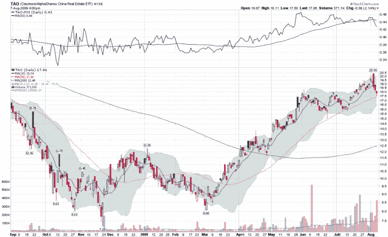

<!--yml

category: 未分类

date: 2024-05-18 17:34:33

-->

# VIX 和更多：中国房地产的 TAO

> 来源：[`vixandmore.blogspot.com/2009/08/tao-of-chinese-real-estate.html#0001-01-01`](http://vixandmore.blogspot.com/2009/08/tao-of-chinese-real-estate.html#0001-01-01)

自 3 月以来，投资者表现极好的两个领域是中国[房地产](http://vixandmore.blogspot.com/search/label/real%20estate)和[股票](http://vixandmore.blogspot.com/search/label/China)。一些投资者无疑有幸站在这两个看涨主题的交汇处，通过投资中国房地产而获利。

历史上，美国投资者对中国房地产市场获得显著投资一直相当困难。然而，在 2007 年 12 月，随着 Claymore/AlphaShares 中国房地产 ETF 的推出，投资者获得了一条通往中国房地产的捷径，该 ETF 旨在追踪 AlphaShares 中国房地产指数的表现，其略显过于可爱的股票代码为[TAO](http://vixandmore.blogspot.com/search/label/TAO)。

在大约一年半的时间里，TAO 几乎无人问津，挣扎着偶尔有一天能达到 10 万股的交易量，但随着中国股票的反弹，TAO 开始受到关注。在过去两个月里，TAO 的成交量一直在提高，这个曾经的小众 ETF 开始吸引主流投资者的关注。

上周，TAO 达到了 20.39 的高点，比 3 月的低点 8.08 高出 2 ½倍。如下图所示，自上周高点以来，TAO 开始受到一些卖压，不仅在绝对基础上，而且与流行的中国 ETF [FXI](http://vixandmore.blogspot.com/search/label/FXI)相比也是如此（见顶部分研究。）今后，TAO 是一个有趣的方式来关注中国房地产市场投机趋势。

最后，如果中国证券开始在全球证券中发挥更多的基准作用，不要感到惊讶。

感谢[Market Rewind](http://marketrewind.blogspot.com/)让我注意到 TAO。

来源：[StockCharts]
