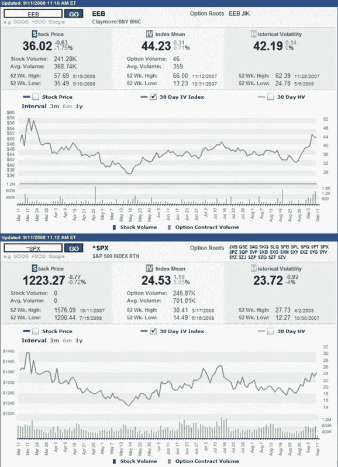

<!--yml

分类：未分类

日期：2024-05-18 18:27:15

-->

# VIX 和更多：美国 VIX 与 BRIC VIX

> 来源：[`vixandmore.blogspot.com/2008/09/us-vix-vs-bric-vix.html#0001-01-01`](http://vixandmore.blogspot.com/2008/09/us-vix-vs-bric-vix.html#0001-01-01)

印度有[印度 VIX](http://vixandmore.blogspot.com/search/label/India%20VIX)，德国有[VDAX](http://vixandmore.blogspot.com/search/label/VDAX)，还有一些其他国家（主要在欧洲）有自己的国家波动指数。然而，在北美和欧洲之外，波动指数的选择很少，因此，当您想要了解更广泛的的国际波动情况时，您必须自己制作。

这正是我今天所做的。

在下面的图表中，下半部分是标普 500 指数的六个月隐含波动率图表。它与 VIX 相似，但并不完全相同。注意 3 月份的高点，7 月中旬的第二个峰，以及最近波动率的上升趋势。

图表的上半部分是加拿大 Claymore BHY[BRIC](http://vixandmore.blogspot.com/search/label/BRIC)（巴西，[俄罗斯](http://vixandmore.blogspot.com/search/label/Russia)，印度，和中国）ETF（[EEB](http://finance.yahoo.com/q?s=EEB)）的隐含波动率，该 ETF 试图复制纽约银行 BRIC 精选 ADR 指数的表现。与 SPX 相比，7 月份 BRIC ETF 的隐含波动率相对适中，但在过去两周内急剧上升。简而言之，美国市场的恐惧和焦虑可能正在缓慢上升，但在巴西，俄罗斯，印度和中国这些关键经济体中，恐慌的迹象更为普遍。

如果[新兴市场](http://vixandmore.blogspot.com/search/label/emerging%20markets)是这个经济放缓期间应该支撑发达国家市场的缓冲区，那么新兴市场需要在润滑全球经济车轮之前找到自己的坚实基础并安抚焦虑的投资者。

来源：[国际证券交易所]
