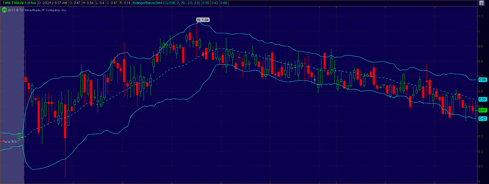

<!--yml

category: 未分类

date: 2024-05-18 16:38:50

-->

# VIX and More: The Ups and Downs of the New Premium in TVIX

> 来源：[`vixandmore.blogspot.com/2012/02/ups-and-downs-of-new-premium-in-tvix.html#0001-01-01`](http://vixandmore.blogspot.com/2012/02/ups-and-downs-of-new-premium-in-tvix.html#0001-01-01)

在今天的常规交易会话中进行了 2 个半小时后，市场似乎开始掌握适合 VelocityShares 日常 2 倍 VIX 短期 ETN（[TVIX](http://vixandmore.blogspot.com/search/label/TVIX)）的溢价水平。

昨天我[指出](http://vixandmore.blogspot.com/2012/02/credit-suisse-suspends-creation-units.html)，瑞士信贷（[CS](http://vixandmore.blogspot.com/search/label/CS)）由于“ETN 规模内部限制”而暂停了 TVIX 的创造单位。今天可以追踪这一决定对 TVIX 股票的影响，相对于其[日内指示价值](http://vixandmore.blogspot.com/search/label/intraday%20indicative%20value)和/或与类似的 ETF，[UVXY](http://vixandmore.blogspot.com/search/label/UVXY)的相对价值。

下面的图形是在 thinkorswim/TD Ameritrade 中使用 TVIX-TVIX.IV 的“标记”创建的，显示了 TVIX 相对于其指示价值的差异。请注意，这种差异在今天的交易会话早些时候高达 1.04 点（6.0%），并在最近几分钟内降至 2.3%。

对于那些无法通过其数据提供商生成 TVIX.IV 报价的人，只需查看今天 TVIX 与 UVXY 变化的百分比变化，以了解新 TVIX 溢价的情况。

显然，市场认为某种溢价是合适的，或许是预期 TVIX 可能发生的做空压力。

任何在今天的交易会话中持有 TVIX 头寸的人显然受到供需不平衡的影响。对于新的多头或空头，未来适当的问题是当前 TVIX 溢价水平是否会增加、减少还是保持不变。在基于几个小时交易的结论之前，最好看看在下一个大的 VIX 飙升期间 TVIX-TVIX.IV 之间的关系会发生什么。我绝不会认为当前的溢价适合所有市场条件。

想要了解 TVIX 的另一视角（以及关于[GAZ](http://vixandmore.blogspot.com/search/label/GAZ)和其他 ETP 异常的顶级研究），请参阅 Kid Dynamite 出色的文章[TVIX – Not Your Daddy’s Blue Chip](http://kiddynamitesworld.com/tvix-not-your-daddys-blue-chip/)。

Related posts:

**

*[source(s): thinkorswim/TD Ameritrade]*

***披露：*** *在撰写时做空 TVIX*
