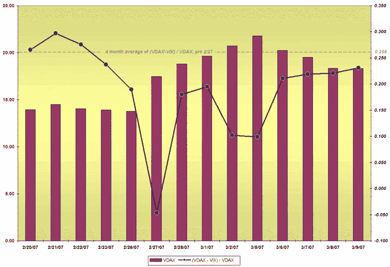

<!--yml

分类：未分类

日期：2024-05-18 15:54:36

-->

# VIX 和更多：2/27 之后的 VDAX 和 VIX

> 来源：[`vixandmore.blogspot.com/2007/03/vdax-and-vix-in-wake-of-227.html#0001-01-01`](http://vixandmore.blogspot.com/2007/03/vdax-and-vix-in-wake-of-227.html#0001-01-01)

当我于 2 月 22 日在本文档中首次介绍[VDAX](http://boerse-frankfurt.com/pip/dispatch/en/pip/gdb_navigation/private_investors/20_Equities/20_Indices/55_VDAX?active=overview&module=InOverview_Index&wp=DE000A0DMX99&wplist=DE000A0DMX99&foldertype=_Index&wpbpl=ETR)时（[点击此处查看](http://vixandmore.blogspot.com/2007/02/introducing-vdax.html)），波动性正与每个大陆的熊一起冬眠，我的评论集中在 VIX 和 VDAX 之间的高度相关性上。我指出这两个指数经常同时交易，但指出 VDAX 有时会滞后 VIX 一个交易日甚至两个交易日。

在 2 月 27 日波动性激增之后，这似乎是一个重新审视这些想法的好时机。

查看 2 月 27 日之前的四个月数据，VDAX（VDAX-NEW）与 VIX 之间的百分比差异在 17%至 36%之间，平均约为 26%（如下图中的虚线灰线所示。）

2 月 27 日，德国市场在美国市场之前早早收盘；当 VIX 当日收盘时，其交易价格比 VDAX 高出 5%。在接下来的几周里，你可以看到 VIX 和 VDAX 之间的领先和滞后猫捉老鼠游戏，因为全球玩家试图在出现任何国际[传染](http://www1.worldbank.org/economicpolicy/managing%20volatility/contagion/index.html)的迹象之前下注。直到最近几天，VDAX-VIX 之间的比率才稳定在一个相对狭窄的交易区间，我认为这是波动性市场的主要玩家认为增加波动性或传染的可能性开始减弱的信号。这些交易员能否准确预测未来还有待观察，但当它们停止在市场间进行波动游戏时，你至少应该将这个信息纳入你的市场展望中。

