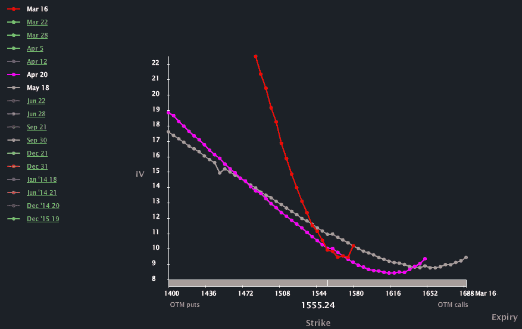

<!--yml

分类：未分类

日期：2024-05-18 16:17:28

-->

# VIX 和更多：VIX，插值和滚动

> 来源：[`vixandmore.blogspot.com/2013/03/the-vix-interpolation-and-roll.html#0001-01-01`](http://vixandmore.blogspot.com/2013/03/the-vix-interpolation-and-roll.html#0001-01-01)

几乎每个月，一些投资者和记者的子集会在每个月第三个星期五发生的标准每月期权到期前的星期一，对 VIX 神奇地暴跌表示极度担忧。

我以前写过关于这个话题的文章，特别是：

VIX 的执行摘要是指在其每月周期的大部分时间里，VIX 是一个通过第一个和第二个月标普 500 指数(SPX)期权合约进行插值的值。在插值中，你面前有两个值，然后试图得到一个介于这两个值之间的值，通常是通过在值之间画一条直线，并试图确定在那个直线上所需的值应该落在哪里。当想要得到一个 30 天的 VIX，而 SPX 期权合约是比如说 17 和 45 天时，那么一个简单的线性插值就实现了这个目标——这就是 VIX 计算方法所做的。

由于 CBOE 规定 VIX 计算中使用的近期月份至少有一个星期的时间到期，因此事情变得更有趣。所以发生的情况是，VIX 在周五使用了 3 月和 4 月的到期，今天 4 月成为近期月份，5 月成为远期月份。由于 4 月的到期日是 4 月 19 日，5 月的到期日是 5 月 17 日，这意味着 VIX 计算中使用的两个月分别有 39 天和 67 天到期。那么 CBOE 是如何得出一个 30 天的 VIX 值的呢？嗯，他们仍然使用近期 VIX 计算（[VIN](http://vixandmore.blogspot.com/search/label/VIN)）和远期 VIX 计算（[VIF](http://vixandmore.blogspot.com/search/label/VIF)），但他们通过使用远期值的*负*权重系数以及远期值系数大于 100%来实现这个任务。

这种方法没有问题，当近期和远期 VIX 的值大致相同时，它能提供合理的数字，但当 SPX 期权的[期限结构](http://vixandmore.blogspot.com/search/label/term%20structure)出现急剧的正向斜率时，在过去两年的大部分时间里都是如此，这会导致 VIX 计算结果远低于 VIN 和 VIF。例如，现在 VIX 是 11.71，而 VIN 是 12.48，VIF 是 13.50。

我的建议是，在 VIX 计算使用 VIF 的负系数时，不要过分关注 VIX，这将是本周剩余时间的情况。相反，那些寻找更好的 VIX 指标的人应该在接下来的四天里关注 VIN。

另外，人们可以参考他们的期权数据提供商提供的 SPX[隐含波动率](http://vixandmore.blogspot.com/search/label/implied%20volatility)计算结果，这些计算结果被整合到了下面的 SPX 偏斜图表中，图表由 LivevolPro 提供。

相关文章：

数据来源：[LivevolPro.com]

***披露(s):*** *Livevol 和 CBOE 是 VIX and More 的广告商*
