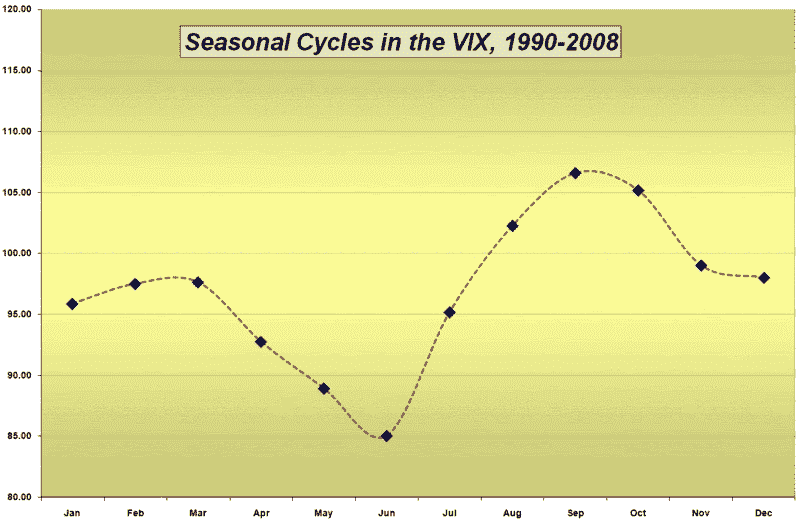

<!--yml

分类: 未分类

日期：2024 年 05 月 18 日 18:09:19

-->

# VIX and More: VIX 年度循环

> 来源：[`vixandmore.blogspot.com/2008/12/vix-annual-cycle.html#0001-01-01`](http://vixandmore.blogspot.com/2008/12/vix-annual-cycle.html#0001-01-01)

两年前，当我是唯一一个阅读这个博客的人时，我发布了关于 VIX [季节模式](http://vixandmore.blogspot.com/search/label/seasonality)的帖子，标题是[A Month By Month Look at the VIX](http://vixandmore.blogspot.com/2007/01/month-by-month-look-at-vix.html)。自那篇原始文章以来，我收到了很多要求使用最新数据更新图表的请求。

紧随昨天的[VIX 节假日压力](http://vixandmore.blogspot.com/2008/12/vix-holiday-crush.html)之后，我很高兴能够以 19 年 VIX 数据的汇总[年度周期](http://vixandmore.blogspot.com/search/label/annual%20cycle)来丰富 VIX 的季节图片。下面的图表与 2007 年 1 月版本几乎没有什么改变。事实上，2008 年几乎完美地遵循了以往年份建立的历史模式，VIX 在 1 月至 3 月期间上升，5 月和 6 月下降，然后在 9 月和 10 月急剧上升。

我对未来年份是否会出现这种模式表示怀疑，但是如果波动性按照相同的季节路径漫游的次数越多，交易者在接下来的几年里寻找重复的可能性就越多。

*[来源: VIX 与更多]*
