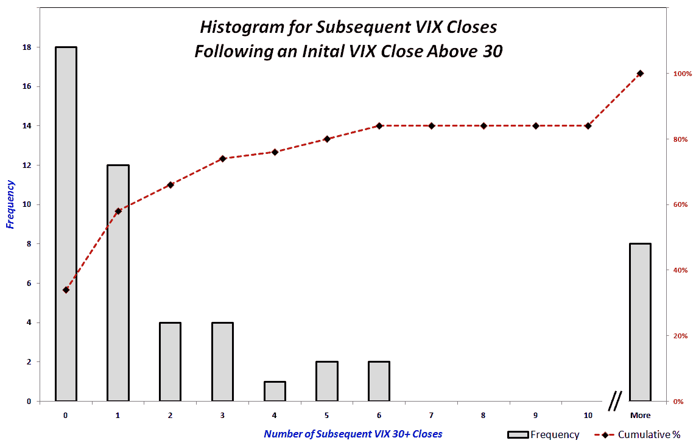

```yml

分类：未分类

日期：2024-05-18 17:23:45

-->

# VIX and More: VIX 尖峰难题

> 来源：[`vixandmore.blogspot.com/2009/11/vix-spike-conundrum.html#0001-01-01`](http://vixandmore.blogspot.com/2009/11/vix-spike-conundrum.html#0001-01-01)

过去几天里，我对看到的大量评论感到绝对惊讶，这些评论认为现在是一个 excellent time to initiate new long positions on VIX options 的好时机。我仍然不确定大多数这种想法背后的原因是什么，但似乎有很多投资者对 VIX 的突破感到兴奋，一些人采取了 Roubini 式的普遍悲观态度，而其他人显然仍然在 2008 年波动率尖峰的阴影下操作。

对于那些认为 VIX 尖峰的 50%是一个做多 VIX 的好时机的人来说，我的回应是，你们的船已经起航了。

我给这篇文章起了个标题叫做*VIX 尖峰难题*，因为就像一支[中国太阳能股票](http://vixandmore.blogspot.com/2008/04/chinese-solar-stocks-on-rise.html)一样，一个上升的 VIX 似乎正在吸引趋势投资者。赌 VIX 的 50%上涨只是更大涨幅的开始是一个愚蠢的赌注。万一读者发现本文底部链接的两个研究中的数据不够有说服力，我增加了一项新的研究，研究 VIX 在首次尖峰高到足以收盘价超过 30 点之后会发生什么。不出所料，这又是[均值回归](http://vixandmore.blogspot.com/search/label/mean%20reversion)在起作用的一个例子。

下面的图表是一个直方图，它总结了 VIX 在首次收盘价超过 30 点之后的未来走势。在 51 个 VIX 未在前一交易日收盘价超过 30 点的情况下首次收盘价超过 30 点的实例中，有 18 次 VIX 在次日收盘价低于 30 点，另外还有 12 个实例反映出 VIX 在两天后收盘价低于 30 点。这意味着有 59%的时间 VIX 在两天内就放弃了收盘价超过 30 点的全部距离以及一些额外的领土。展望四天后的情况，VIX 的收盘价已经低于 30 点大约 75%，正如虚线红色所示。

请注意，虽然有 84.3%的时间 VIX 在六天后已经收盘低于 30，但剩下的 15.7%的案例可能会使交易员盈利或亏损。在六次（11.8%）的情况下，VIX 在首次收盘高于 30 后至少连续 23 天保持在 30 以上。这比一个完整的期权周期略多。在 2008 年 10 月之前，那些做空 VIX 看涨期权的交易者可以合理地预期 VIX 不会高于 45，在当时这是[VIX 的历史最高记录](http://vixandmore.blogspot.com/2008/09/top-five-vix-spikes.html)。现在我们已经亲眼见证了 VIX 在两次不同的情况下超过了 80，我怀疑投资者高估了 VIX 再次出现这种规模飙升的可能性。除非有另一个急性系统性威胁，否则我会非常惊讶看到 VIX 上涨超过 45 的水平。

在当前市场环境下，做空波动率的概率有利于短线操作，比如对 VIX 进行[熊市看涨期权 spread](http://vixandmore.blogspot.com/search/label/bear%20call%20spread)。持有 VIX 看涨期权的长期操作并不仅仅是低概率事件，而且它们也非常昂贵。然而，如果投机者急于买入这些期权，我并不介意，因为我很高兴有一个现成的买家来购买一些 VIX 看涨期权。

关于这个话题的相关文章，读者可以查看：



*免责声明*：在撰写本文时做空 VIX。
