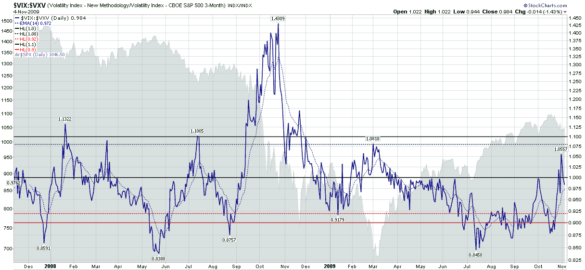

<!--yml

分类：未分类

日期：2024-05-18 17:23:30

-->

# VIX 和更多：VIX:VXV 比率、可得性偏见和灾难印记

> 来源：[`vixandmore.blogspot.com/2009/11/vixvxv-ratio-availability-bias-and.html#0001-01-01`](http://vixandmore.blogspot.com/2009/11/vixvxv-ratio-availability-bias-and.html#0001-01-01)

曾经是这个领域的一个热门话题，[VIX:VXV 比率](http://vixandmore.blogspot.com/search/label/VIX%3AVXV)在 2008 年 10 月的金融动荡和创纪录的波动率激增中似乎成了牺牲品，当时该比率创下了纪录水平，并产生了一个后来证明是一场灾难的买入信号。

我还没有准备好放弃 VIX:VXV 比率，所以当我看到从 11 月到 1 月它产生了一些有帮助的多头和空头信号时，我感到很欣慰。在一个充满希望的发展中，3 月 2 日，该比率在市场触底前一刻发出了买入信号。当 VIX:VXV 比率在 6 月敦促谨慎时，我更有理由感到乐观。然后，再次，该比率又大失所望，在 7 月中旬市场开始反弹后发出了卖出信号。更糟糕的是，该比率并没有回到中立区域（0.92 至 1.08 之间），而是坚持看跌建议，直至 10 月顶部。

我正要把 VIX:VXV 比率归入“有时有用但并不总是一致”的范畴，但当我开始思考波动水平与[可得性偏见](http://vixandmore.blogspot.com/search/label/availability%20bias)和[灾难印记](http://vixandmore.blogspot.com/search/label/disaster%20imprinting)的关系，以及[VIX 与实现波动率之间的差距](http://vixandmore.blogspot.com/2009/08/gap-between-vix-and-realized-volatility.html)和[VIX 波动和 VIX 期货正向市场意味着…](http://vixandmore.blogspot.com/2009/10/vix-spike-and-futures-contango-means.html)时，我决定重新考虑。在我看来，所有这些主题都是相关的。实现波动率差距、持续的 VIX 期货[正向市场](http://vixandmore.blogspot.com/search/label/contango)和偏移的 VIX:VXV 比率（见下表）都是市场运作不正常症状的表现，而可得性偏见和灾难印记是这种情况的主要原因。

此外，VIX 期货期限结构现在平坦，VIX:VXV 比率在上周五达到了 3 月 6 日以来的新高 1.056，这表明波动率形势可能开始呈现出雷曼兄弟破产前的某些特征——如果不是完全恢复到“正常”状态的话。

就我个人而言，我还是认为现在的 VIX 比一个月后的实际波动率要高一点，但是相对于实际波动率较高的 VIX 可能是全球金融危机更为持久的影响之一，因为每位投资者对于可用性偏见和灾难性印记影响他们看待投资景观的时间长度都有他们自己的半衰期。

对于上述一些主题的额外文章，读者们被鼓励去查看：

**来源：[StockCharts]**

**声明**：在撰写本文时做空 VIX.*
