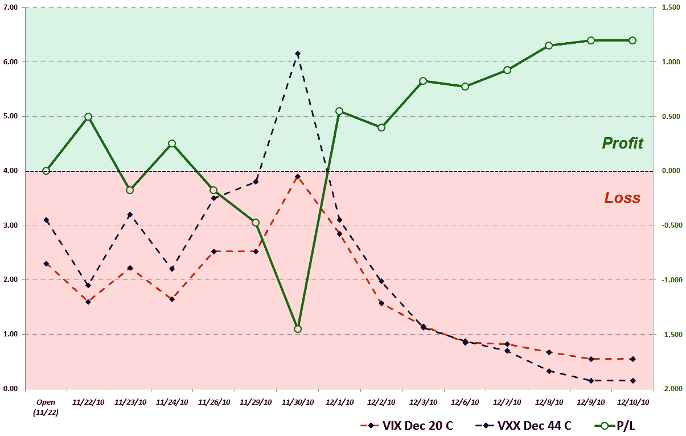

<!--yml

类别：未分类

date: 2024-05-18 16:42:36

-->

# VIX 和更多：VIX-VXX 半人马贸易。

> 来源：[`vixandmore.blogspot.com/2012/01/vix-vxx-minotaur-trade.html#0001-01-01`](http://vixandmore.blogspot.com/2012/01/vix-vxx-minotaur-trade.html#0001-01-01)

*[以下内容首次出现在 2010 年 12 月版的《Expiring Monthly: The Option Traders Journal》中](http://www.expiringmonthly.com/)。我之所以分享它，部分原因是我有一篇文章，“合成季节性 VIX-VXX 套利”，这篇文章出现在刚刚出版的 2012 年 1 月版《Expiring Monthly》中，扩展了下面一些想法的讨论。]*

**理由**

在希腊神话中，米诺陶洛斯是一种拥有男人身体和公牛头的混合生物。这种生物为涉及做空[VXX](http://vixandmore.blogspot.com/search/label/VXX)平值看涨期权和做多 VIX 平值看涨期权的配对交易提供了灵感。

假日季节交易日数不足，且历史上具有看涨倾向。因此，12 月 VIX 期货相对于 1 月 VIX 期货通常会保持相对平静。假设我能以净信用建立这个位置，涉及做空 VXX 看涨期权与做多 VIX 看涨期权的波动性季节交易，如果以下三个关键因素中的任何一个占主导地位，就有可能获利：

1.  波动性下降，两种期权都变得毫无价值。

1.  VIX 期货仍处于[正向市场](http://vixandmore.blogspot.com/search/label/contango)。

1.  波动性激增，VIX 对激增的反应比 VXX 更为敏感。

虽然可以回测这个策略，但有时我喜欢建立交易，看看它如何发展，并了解一些潜在的障碍。我完全理解结果将不具有统计意义，从一次交易中得出关于策略的任何推断都是危险的，但我确实发现这些我所说的“概念验证”交易中有一些价值。

在大多数交易中，以最小的风险获得最大的利润是唯一的目标。在概念验证交易中，利润很重要，但信息也同样重要。因此，我倾向于将概念验证交易保留更长的时间，而不是当我使用已确立的策略交易时。

在比例方面，我的意图是保持简单。目前 VIX 的交易价格略低于 VXX 的 49%，我的研究显示，VXX 通常每天会随着 VIX 移动大约 48%，因此，当 VIX 约为 22，VXX 约为 45 时，我选择以 1:1 的比例进行这个配对交易，使用每种 10 份合约来简化数学计算。

**设置和进入**

在一个盈利最大化的世界里，我可能会等待 VIX 达到相对较高水平才进入这笔交易，但由于我也关注交易的 informational value，我选择在 11 月 22 日的交易日开始建仓，此时 VIX 在其 10 日波动范围的中部。

在 VIX 为 22.03，VXX 为 44.98 的情况下，强烈诱惑着人们严格保持现金状态，同时做空 VXX 的 12 月 45 美元看涨期权，而做多 VIX 的 12 月 22 美元看涨期权。对于十份合约来说，如果两种期权都到期一文不值，潜在利润将不到 1000 美元。鉴于我对季节性低波动率的预期，以及 VIX 期货高额的远期溢价，我选择稍微调整一下概率，做空稍微接近现金的 VXX 的 12 月 44 美元看涨期权，同时做多 VIX 的 12 月 22 美元看涨期权。这使得如果两种期权都到期一文不值，潜在利润再增加 200 美元。在试图稍微调整订单之后，我屈服了，接受市场给予的价位，记录 VIX 交易方面的滑点为 175 美元，VXX 方面为 100 美元。我仍然设法在这笔交易中赚了 800 美元，这使得我手头还有 2.30 美元的 VIX 12 月 22 日看涨期权多头头寸和 3.10 美元的 VIX 12 月 44 日看涨期权空头头寸。

**头寸管理**

在管理这两个头寸时，首先要记住的一个重要点是它们运行在不同的到期周期上。VIX 期权在 12 月 17 日到期，而 VXX 期权则在五天后，即 12 月 22 日到期。因此，我预计我将最迟在 12 月 16 日退出头寸，这是 VXX 期权最后交易的日子。

**11 月 22 日，星期一**——运气使然，VIX 在交易执行时间和当天结束之间下跌了 8.3%，将两种看涨期权都推出了现金状态，为头寸锁定 500 美元的利润。

**11 月 23 日，星期二**——VIX 今天反转走高，比买入 VIX 看涨期权时高了 0.60。VXX 在今天的波动中落后，比卖出 VXX 看涨期权时低了 0.06。VXX 的相对弱势对我的头寸听起来是个好消息，但 VXX 看涨期权今天飙升了 64%，而 VIX 看涨期权仅上涨了 39%。交易盈利从+500 美元转为-175 美元，仅用了 24 小时。

**11 月 29 日，星期一**——在感恩节前后经历了一些起伏之后，周末见证了爱尔兰救援计划的正式化以及朝鲜半岛紧张局势的升温。VIX 和 VIX 的 12 月（前端月份）期货均收盘于 21.50 水平附近，而 VXX 跳升至 46.10。VIX 看涨期权和 VXX 看涨期权都处于现金状态，我的头寸在一周内下跌了 475 美元。我现在每天能享受到 36 美元的 theta，但我失望于 VIX 的飙升对 VXX 看涨期权的影响大于对 VIX 看涨期权的影响。

**2023 年 11 月 30 日** – VIX 收盘于 23.54，这是自 9 月以来最高的收盘水平，因为对欧元区和朝鲜未来的担忧持续存在。我的 VIX 看涨期权目前盈利 15%，而我的 VXX 看跌期权盈利 10.7%，然而 VXX 期权对波动性的增加仍然更为敏感。今天 VXX 期权飙升 62%，而 VIX 期权上涨 54%。该头寸今天亏损 975 美元，累计亏损 1450 美元。如果这不是一个概念验证交易，我会在这个阶段退出交易或做出调整以限制风险。照目前的情况，我会让交易继续运行，因为我的首选指标表明 VIX“超买”，正准备出现一些均值回归。我现在 36 美元的 theta 只是九牛一毛。

**2023 年 12 月 1 日** – 今日出现了巨大的转机。VIX 下跌 10.2%，而 VXX 仅下跌 5%，但 VXX 期权市值下跌了 50%，而 VIX 期权市值下跌了 27%。结果使得头寸波动 2000 美元，盈利 550 美元。

**2023 年 12 月 3 日** – 在周三和周四分别下跌超过 10%之后，今日 VIX 再次下跌 7.7%，因为地缘政治和宏观经济担忧消退，取而代之的是一种日益增长的乐观情绪。在三天的时间里，VIX 从 23.54 跌至 18.0，跌幅为 23.5%，而 VXX 从 49.29 跌至 41.30，跌幅为 16.2%。由于看涨期权远远不在行权价之内，且该头寸的总收益已达到 825 美元（超过了 800 美元的盈利目标），在这里我将退出头寸以锁定利润，但这是一个概念验证交易，所以我会让它继续运行…

**2023 年 12 月 10 日** – 下面的图表详细说明了交易的完整生命周期，该交易今天结束。值得注意的是，在最后一周，VIX 相对稳定，而 VXX 由于负[滚动收益率](http://vixandmore.blogspot.com/search/label/roll%20yield)和 VIX 期货[期限结构](http://vixandmore.blogspot.com/search/label/term%20structure)的普遍下跌而失去了显著的价值。结果是，当看涨期权被空头持有时，VXX 处于 2.1%的盈利状态，现在则完全处于 15.4%的亏损状态，而看涨期权的市值仅为 0.15。VIX 的表现要好得多，起初 0.1%的盈利状态，现在则为 13.6%的盈利状态。由于 VIX 期权具有更高的波动性，以及 VIX 到期周期多出的五天，看涨期权仍然保留了 0.55 的价值。在最后三天，该头寸的盈利一直在 1150 至 1200 美元之间。由于在到期前 1.5 周里，这笔利润几乎肯定会减少到 800 美元，我决定结束这笔交易。

**尾声与启示**

第一个重要的启示是，只要有耐心，一个净空 VXX 仓位的 VIX Minotaur 交易确实可以盈利。另一方面，这个交易可能非常波动，并要求给予风险管理极大的关注。在除了概念验证环境之外的情况下，我会在它有机会回到盈利状态之前很久就已经平仓亏损。

我有点失望，VIX 的飙升并没有给 VIX 期权带来与 VXX 期权相同的提振。这是因为 VXX 期权最终比 VIX 期权对基础资产的变化更为敏感，这是一个关键的教训。未来的交易应该尝试确定这是否是一个持续的主题。

另一个重要的考虑因素是两个到期周期的时机。在这个实例中，由于 VIX 期权的到期在 VXX 期权之后，因此这个头寸受益。在 8 月和 9 月，VIX 期权在 VXX 期权之前到期，所以我本来预计在这两个到期周期中，这个交易会面临更具挑战性的环境。

未来的努力可能希望调整 VIX 和 VXX 期权的深度亏损程度，以及调整比例中的单位，以给予 VIX 期权更高的权重。

最终，概念验证交易的得分增加了一分。当涉及到真实资金时，感知更为敏锐，情绪反应及其与交易之间的互动更为真实，最终学到的任何教训都更深刻地印在交易心理上。

相关文章：

**披露：** *当前持有 VXX 空仓；我是 Expiring Monthly 的创始人之一和所有者。*
