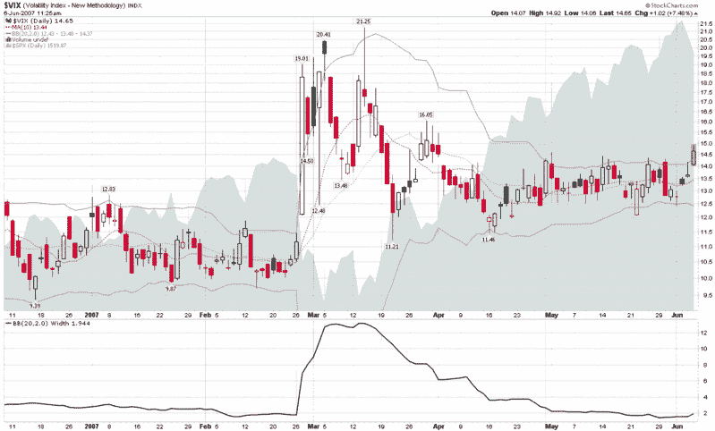

<!--yml

category: 未分类

date: 2024-05-18 19:11:51

-->

# VIX 与更多：VIX 和布林带

> 来源：[`vixandmore.blogspot.com/2007/06/vix-and-bollinger-bands.html#0001-01-01`](http://vixandmore.blogspot.com/2007/06/vix-and-bollinger-bands.html#0001-01-01)

我不确定我是如何在这个博客上浪费了五个月的时间，并且在[这里](http://vixandmore.blogspot.com/2007/01/absolute-vs-relative-highs-and-lows-in.html)几乎没有时间谈论布林带（BBs）和 VIX，但今天似乎是立即开始的好时机。

首先，对于任何需要简要了解布林带是什么或如何计算的人，我建议您参考 StockCharts.com 的[概述](http://stockcharts.com/school/doku.php?id=chart_school:technical_indicators:bollinger_bands)；关于如何将 BB 应用于交易的一些想法，OnlineTradingConcepts.com 有一个[很好的总结](http://www.onlinetradingconcepts.com/TechnicalAnalysis/BollingerBands.html)。  有关布林带的最佳详细信息来源，不出所料，来自约翰·博林格自己的网站，[BollingerBands.com](http://www.bollingerbands.com/)。 不幸的是，约翰没有免费提供关于 BB 的很多想法，但是您可以从 2001 年他的一个[15 条基本规则](http://www.bollingerbands.com/services/bb/?page=8)列表中了解他的想法。

我在下面包含了 VIX 的六个月图表，默认（20,2,0）BB 设置以及[BB 宽度](http://stockcharts.com/school/doku.php?id=chart_school:technical_indicators:bollinger_band_width)指标和 SPX 的叠加。  对于今天，我只打算提供一些观察结果（根据这张图表和一些回顾超过六个月截止日期的研究）：

+   当 VIX 触及其布林带时，通常是考虑进行 VIX 均值回归操作的好时机

+   当 VIX 触及其布林带时，通常会标志着 SPX 趋势的短期变化

+   VIX 收盘价超出布林带（我们今天将达到）几乎总是与戏剧性的市场变动和/或趋势变化相关联

+   当 VIX BB 宽度低于 1.8 时，经常会标志着整理即将结束，急剧变动即将到来

+   回顾到 3 月底，VIX 收盘超过 15 肯定在支撑和阻力方面具有重要意义（目前我们的交易价格为 14.76）

