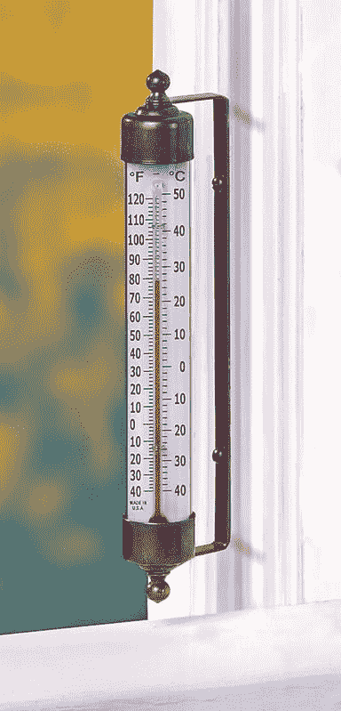

<!--yml

category: 未分类

date: 2024-05-18 18:42:30

-->

# VIX and More: VIX 与做空

> 来源：[`vixandmore.blogspot.com/2008/02/vix-and-going-short.html#0001-01-01`](http://vixandmore.blogspot.com/2008/02/vix-and-going-short.html#0001-01-01)

一位读者询问了关于下降的 VIX 是否可以提供新的空头入场信号的可行性。具体来说，他注意到[他的 VIX 周线图](http://stockcharts.com/h-sc/ui?s=%24VIX&p=W&b=5&g=0&id=p71890196213)，该图使用 43 周简单移动平均线，包含了过去一年左右 VIX 的所有动作，而那个 43 周的 SMA 充当了支撑位。最终，他的问题是我是否认为 43 周的 SMA 很可能保持支撑。

在我详细回答那个问题之前，让我重申一下我对在 VIX 上使用传统技术分析的一般看法。简而言之，我相信因为 VIX 是一个衍生品（更准确地说[是一个衍生品的衍生品](http://vixandmore.blogspot.com/2007/05/vix-futures-starter-kit.html)），传统技术分析的有效性非常有限。这在与支撑位和阻力位有关时尤其值得注意。例如，如果 VIX 触及 20，没有人可以匆忙买入 VIX 以在那一水平提供支撑，因为不能买卖现金 VIX。当然，一些人可能会将 VIX 的 20 作为开始购买 VIX 期权或期货的理由，但这些交易对现金 VIX 的影响是间接且微弱的。如果交易员使用 VIX 信号购买 SPX 期权，这种影响会变得更强一些，但我仍然更愿意将 VIX 视为更像温度计而不是实际的天气现象。即使是一位主要的神祇，也很难调整阳光、云层等因素，使得你后门廊的温度读数正好为 60 华氏度。

因此，我通常不倾向于将移动平均线视为 VIX 提供有意义的支撑和阻力，因为我相信衍生品的衍生品的算术平均值不是一个有意义的数字。然而，我相信 VIX 之前的中期和长期的高点和低点（例如，1 月份的 37.57），整数（20、25、30 等），以及与各种移动平均线（10 日 SMA 的百分比等）的重要幅度偏差可以信号（或许甚至触发）重要的心理里程碑，并提供高概率的入场。

因此，我的结论是，如果 43 周的 SMA 与之前的低点、整数距离或与某些关键 SMA 的距离相一致，那么它更有可能保持支撑。考虑到当前的数字，我认为 VIX 的强烈支撑最有可能在 19-20 的范围内找到。

为了好玩，我附上了三张图表，提供了对 VIX 的三种非常不同的视角。上面的图表是 VIX 过去一年的基本图表。就像主要股指一样，三角形态的整理是很明显的，但 VIX 的模式要追溯到八月。 [VIX:VXV](http://vixandmore.blogspot.com/search/label/VIX%3AVXV)比率图表显示了未来 30 天（VIX）与未来 93 天（[VXV](http://vixandmore.blogspot.com/search/label/VXV)）的波动性预期——而这些最多只能算是中等。最后一张图表显示了 VIX 与 SPX 的寿命对比图，在图表中加入了一条水平线，显示 VIX 的寿命平均值（19.03）以供参考。从这些图表中可以得出许多潜在的结论，但当我把它们综合起来时，我对 VIX 的中期到短期框架持中立态度。

顺便说一下，说到开新空头仓位，我不喜欢在一个月至少第三个交易日之前做空，特别是考虑到有多少焦虑的资金在观望。最后，关于支撑和阻力，我更喜欢使用宽泛的股指而不是 VIX 来判断入场时机，并且会比关注 VIX 更密切地关注 SPX 1410 和[NDX](http://vixandmore.blogspot.com/search/label/NDX) 1900，但同时也会密切关注 VIX 19。
