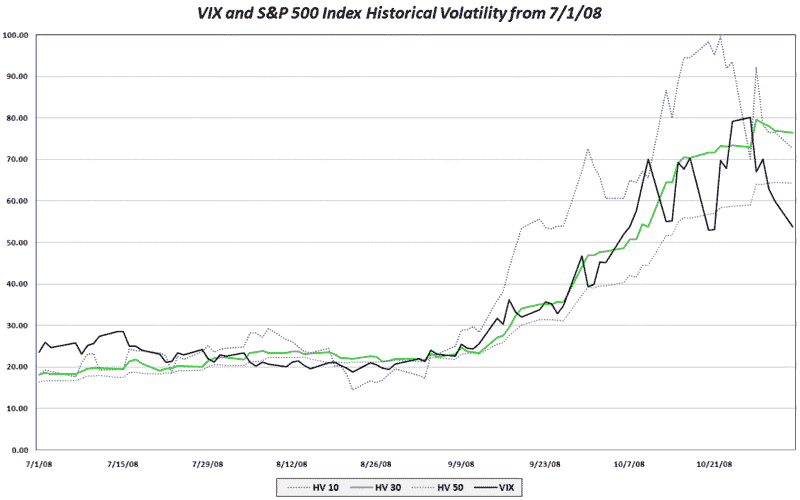

<!--yml

分类：未分类

date: 2024-05-18 18:17:40

-->

# VIX and More: The VIX and Lagging Historical Volatility

> 来源：[`vixandmore.blogspot.com/2008/11/vix-and-lagging-historical-volatility.html#0001-01-01`](http://vixandmore.blogspot.com/2008/11/vix-and-lagging-historical-volatility.html#0001-01-01)

根据定义，历史波动率总是回顾性的，并且滞后于实时波动环境。在过去两个月里，波动率趋势变得更加明显，这种现象不太明显。然而，在当前市场环境下，股票和 VIX 等隐含波动率指标正在反转，许多历史波动率指标似乎与使用后视镜在蜿蜒公路上驾驶没有区别。

下图显示，尽管标普 500 的 30 日历史波动率在一周前达到峰值，但自那以来仅下降了 4%。毫不奇怪，50 日历史波动率指标对近期市场变化的反应甚至更不明显，并已进入平稳期，似乎对波动率的近期变化视而不见。相比之下，10 日历史波动率指标下降了 27%；它更准确地反映了 VIX，并且在 VIX 达到顶峰的三天前就暗示了 VIX 可能的反转。

10 日历史波动率是 erratic 和倾向于反映低信噪比的读数。然而，当波动率迅速变化时，10 日历史波动率通常比其 30 日同类更好地作为 VIX 的代理，并且比其 30 日同类提供更 meaningful 的比较基准。

[source: VIX and More]
