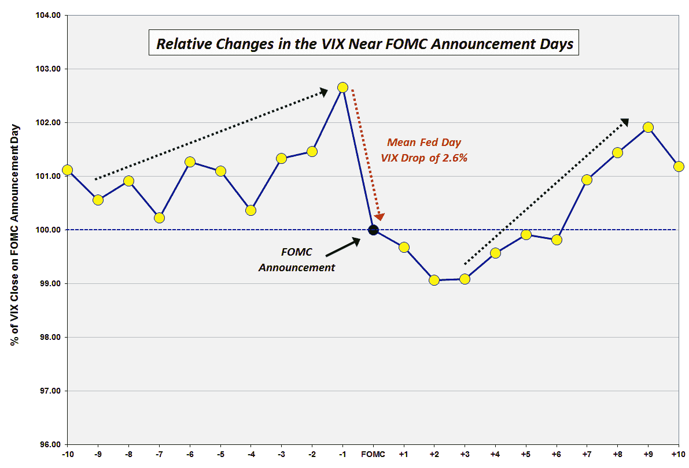

<!--yml

分类：未分类

日期：2024-05-18 16:15:45

-->

# VIX and More: 美联储会议前后的 VIX 交易

> 来源：[`vixandmore.blogspot.com/2013/06/the-vix-and-pre-fomc-post-fomc-trades.html#0001-01-01`](http://vixandmore.blogspot.com/2013/06/the-vix-and-pre-fomc-post-fomc-trades.html#0001-01-01)

早在 2008 年 12 月，在[VIX 趋势：美联储会议宣布日](http://vixandmore.blogspot.com/2008/12/vix-trends-around-fomc-announcement.html)一文中，我发布了一张 VIX 在美联储会议宣布前后的十天内平均变动的图表，这些日子被称为“美联储日”，即联邦公开市场委员会（FOMC）宣布政策声明的日子。一些长期读者还记得那张图表——以及更早的一张来自[VIX 在美联储会议附近的变动](http://vixandmore.blogspot.com/2007/01/vix-price-movement-around-fomc-meetings.html)的版本——最近询问了一个更新版本。在所有目光都集中在美联储的声明和本·伯南克的新闻发布会上星期三，这似乎是一个很好的时间重新审视 VIX 在美联储会议宣布前后的动向。

在下面的图表中，我将 VIX 数据追溯到 1990 年并进行归一化，以便轻松比较在美联储政策声明公布前后的十天内 VIX 的平均日变动。快速结论是，过去五年的数据与 2008 年的数据一致。这幅图表仍有三个主要特点：

1.  在美联储会议宣布前三天的 VIX 上涨，VIX 倾向于在这段时间内急剧上升，而在会议宣布前 1-2 周逐渐上升。

1.  在美联储会议宣布当天，VIX 平均下降约 2.6%，随后两天 VIX 继续下降约 1.0%左右。

1.  在美联储会议宣布三天后开始急剧反弹的 VIX，并在宣布后的九个交易日内持续。

在过去五年中，VIX 在会议宣布前三天的上涨更为陡峭，而在那段时间前一周或更长时间的上涨更为平缓。此外，最近的历史见证了 VIX 在会议宣布后的下降延长了两天，现在宣布后的四天内都在下降。

当然，没有理由期待过去 33 年中持续的模式会在未来的每次美联储会议上神奇地重新出现，但我确实认为历史模式确实说明了人性、不确定性和对[风险](http://vixandmore.blogspot.com/search/label/risk)的感知。

值得注意的是，在美联储会议当天 VIX 最大的一次日间跳升发生在 1994 年 2 月 4 日[1994](http://vixandmore.blogspot.com/search/label/1994)，当时美联储主席艾伦·格林斯潘宣布将联邦基金利率上调 0.25%，令市场感到惊讶，当天 VIX 因此上涨了 41.9%。作为比较，下一次最大的美联储会议当天 VIX 增加是在 2011 年 3 月 15 日，当时 VIX 增加了 15.1%。尽管可能会有另一波 VIX 的上涨，但历史数据显示，周三 VIX 下跌的概率为 72%，跌幅应平均约为 2.6%或根据当前 VIX 水平大约 0.44。

这里有什么交易机会呢？尽管许多人可能会尝试猜测周三走势的方向，但具有历史偏向的其他三个交易包括：

1.  在周三宣布前 VIX 的增加

1.  从周四到周一 VIX 的任何下降延续

1.  从周一或周二开始，VIX 出现新的上升趋势，并持续到 7 月初。

***来源(s): CBOE, Yahoo, VIX and More***

相关文章：

***披露信息(s):*** *无*
