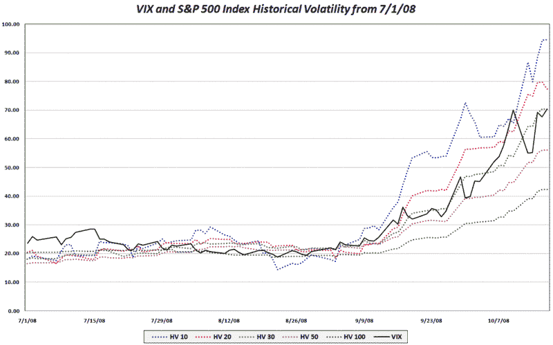

<!--yml

分类：未分类

日期：2024-05-18 18:20:03

-->

# VIX and More: 在 SPX 历史波动率背景下的 VIX

> 来源：[`vixandmore.blogspot.com/2008/10/vix-in-context-of-historical-volatility.html#0001-01-01`](http://vixandmore.blogspot.com/2008/10/vix-in-context-of-historical-volatility.html#0001-01-01)

下面的图表使用了与前一篇帖子相同的数据（7/1 - 10/17/08），但添加了 VIX 以直观显示 VIX 相对于 SPX 过去几个月的历史波动率所处的范围。

[来源：VIX and More]
