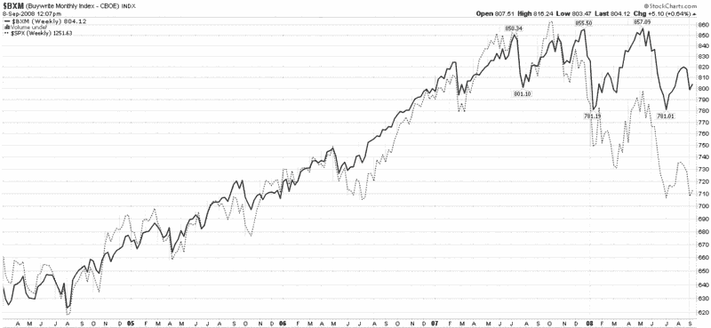
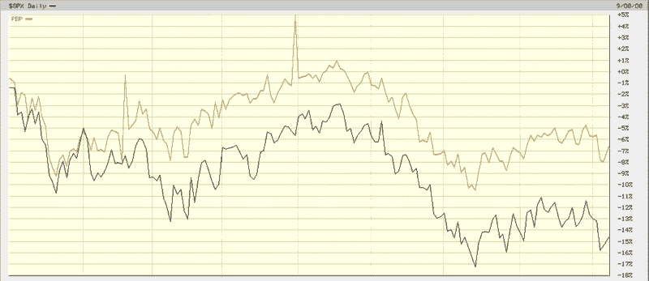

<!--yml

分类：未分类

日期：2024-05-18 18:27:54

-->

# VIX and More: 卖出覆盖式看涨期权的价值

> 来源：[`vixandmore.blogspot.com/2008/09/value-of-selling-covered-calls.html#0001-01-01`](http://vixandmore.blogspot.com/2008/09/value-of-selling-covered-calls.html#0001-01-01)

一个被关注不够多的主题是价值投资者可以从出售**覆盖式看涨期权**中提取的价值。公平地说，覆盖式看涨期权策略牺牲了有时可能相当可观的上行空间以换取固定回报，但这种策略在震荡市场中可能非常有效。

下面的图表是一个周线图，显示了 CBOE S&P 500 Buy-Write Index ([BXM](http://vixandmore.blogspot.com/search/label/BXM))，旨在复制 S&P 500 指数的买入写入或覆盖式看涨期权策略。注意在最近的牛市中，买入写入策略导致的结果与持有 SPX 大致相同，但波动性更小。

[来源：StockCharts]

更重要的是，在过去的一年中，买入写入策略显著超越了 SPX。详情可以在下一张图表中看到，一个新的 ETF，PowerShares S&P 500 BuyWrite Portfolio ([PBP](http://vixandmore.blogspot.com/search/label/PBP))的贬值速度不到 SPX 贬值速度的一半。

在横盘市场、下跌市场甚至上涨市场中，买入写入或覆盖式看涨期权的方法，如 PBP（或首先堂兄弟[BEP](http://vixandmore.blogspot.com/search/label/BEP)和[MCN](http://vixandmore.blogspot.com/search/label/MCN)）可以是增加回报和降低风险的极好方式。

[来源：BigCharts]
