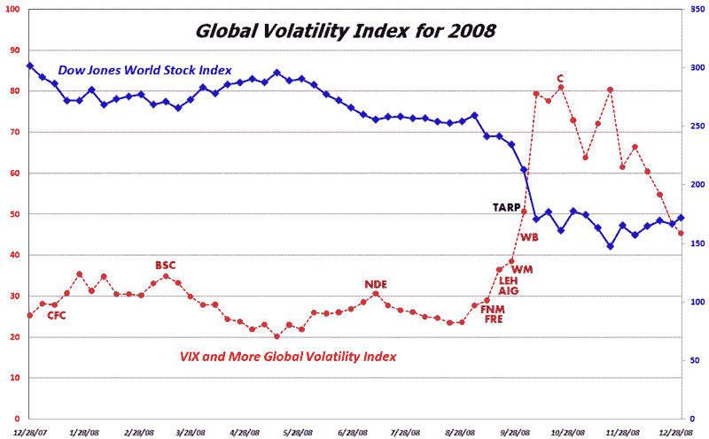

<!--yml

分类：未分类

日期：2024-05-18 18:07:47

-->

# VIX and More: 2008 年全球波动年度回顾

> 来源：[`vixandmore.blogspot.com/2009/01/year-in-global-volatility.html#0001-01-01`](http://vixandmore.blogspot.com/2009/01/year-in-global-volatility.html#0001-01-01)

在 2008 年 11 月，我推出了*VIX and More* [全球波动指数](http://vixandmore.blogspot.com/search/label/Global%20Volatility%20Index)，这是一个由全球[15 大经济体](http://en.wikipedia.org/wiki/List_of_countries_by_GDP_%28nominal%29)的股票期权隐含波动率的加权平均数构成的指数。我会在 2009 年有更多关于全球波动指数的内容，但我想借此机会强调这个指数，作为跟踪过去一年中重大波动事件引起波动率上升的手段。除了全球波动指数（显示为红色）外，下面的图表还捕捉到了[道琼斯全球股票指数](http://vixandmore.blogspot.com/search/label/Dow%20Jones%20World%20Stock%20Index)（蓝色），以及美国政府的救助或失败的金融公司的 TARP 立法签署（黑色）和一些主要金融公司的股票代码（深红色）。

来源：[VIX and More](http://vixandmore.blogspot.com/)
