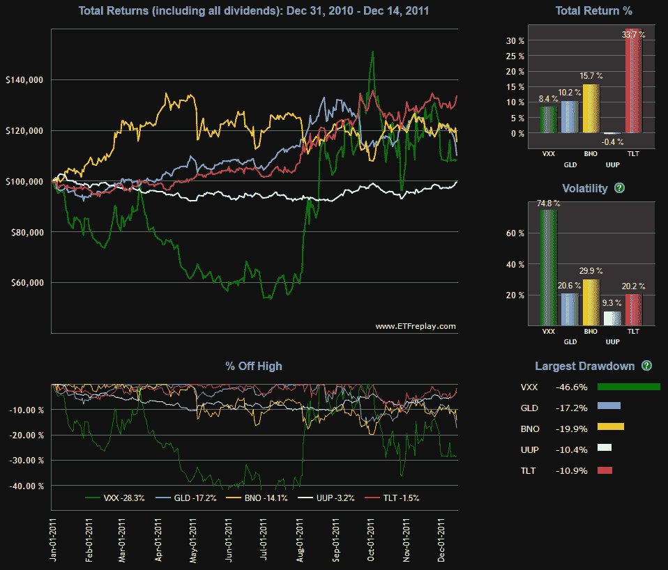

<!--yml

分类：未分类

日期：2024-05-18 16:45:43

-->

# VIX and More: 避风港年度回顾

> 来源：[`vixandmore.blogspot.com/2011/12/year-in-safe-havens.html#0001-01-01`](http://vixandmore.blogspot.com/2011/12/year-in-safe-havens.html#0001-01-01)

今天早些时候，在[避风港选项缩水？](http://vixandmore.blogspot.com/2011/12/safe-haven-options-shrinking.html)中，我注意到了一些最近在波动性、黄金和原油证券的避风港交易未能对股票的最新下跌进行对冲。

许多观察者都有一个问题，那就是这些“五大避风港”交易——波动性([VXX](http://vixandmore.blogspot.com/search/label/VXX)),黄金([GLD](http://vixandmore.blogspot.com/search/label/GLD)),原油([BNO](http://vixandmore.blogspot.com/search/label/bno)),美元([UUP](http://vixandmore.blogspot.com/search/label/UUP))和美国国债([TLT](http://vixandmore.blogspot.com/search/label/TLT))——在整个 2011 年的波动性风暴中表现如何，从第一季度末的[阿拉伯之春](http://vixandmore.blogspot.com/search/label/Arab%20Spring)和日本地震/海啸/核灾难，到美国[债务上限](http://vixandmore.blogspot.com/search/label/debt%20ceiling)的闹剧，以及困扰投资者余下 2011 年的与[欧洲主权债务危机](http://vixandmore.blogspot.com/search/label/European%20sovereign%20debt%20crisis)相关的似乎无尽的灾难浪潮。

下面的图表，来自[ETFreplay.com](http://etfreplay.com)，显示了五大避风港 ETP 今年的表现，以及历史波动率和回撤数据。

值得注意的是，尽管 VXX 今年上涨，但很难想到任何从年初到谷底的 46.6%跌幅的避风港。

回顾 20-20 的远见，如果一个人能够在一年中最有利的时间切换避风港工具，那么在整个阿拉伯之春和直到 6 月初，布伦特原油将是最佳选择，在此之后，黄金将是最佳选择，直到 8 月，波动性在 10 月初是最好的选择，而国债是最后两个月理想的[对冲](http://vixandmore.blogspot.com/search/label/hedging)。虽然美元最近有所回升，但假设没有使用杠杆，货币市场的相对低波动性意味着美元是将投资资本停放直到 perceived threat passes 的地方，而不是作为股票下跌的对冲工具。

相关文章：

**

*[来源：ETFreplay.com]*

****披露(s):*** *在撰写本文时做空 VXX 和 TLT*
