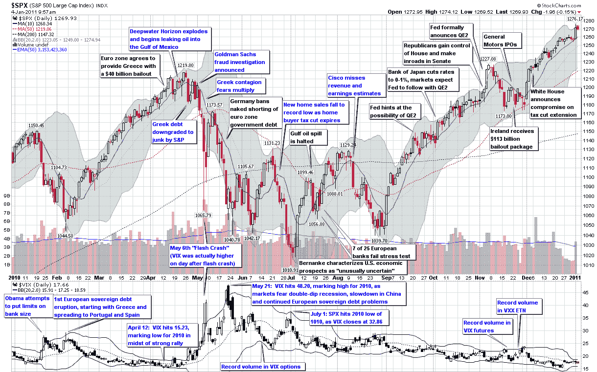

<!--yml

category: 未分类

date: 2024-05-18 16:55:00

-->

# VIX 和更多：VIX 和波动性（2010 年）

> 来源：[`vixandmore.blogspot.com/2011/01/year-in-vix-and-volatility-2010.html#0001-01-01`](http://vixandmore.blogspot.com/2011/01/year-in-vix-and-volatility-2010.html#0001-01-01)

去年大家最喜欢的图表之一是[图表一周：2009 年的 VIX 和波动性](http://vixandmore.blogspot.com/2010/01/chart-of-week-vix-and-volatility-in.html)的基础，我创建了一个相当简洁的注释总结，涵盖了 VIX 和波动性的全年情况。

不知何故，同样的图表在 2010 年似乎更难制作，部分原因是波动性触发因素不那么明显，似乎一波接一波地出现，每次似乎都带来了不同规模的威胁。欧洲主权债务危机是威胁波的典型例子，还有对中国应对经济增长放缓和通胀上升能力担忧也是。在美国，对双底衰退的担忧起伏不定，而投资者们挠头思考究竟应该对 foreclosure 危机或朝鲜半岛事件多么担忧。

在波动性方面，2010 年的亮点包括 5 月份的“[闪崩](http://vixandmore.blogspot.com/search/label/flash%20crash)”和月末时更大的[VIX](http://vixandmore.blogspot.com/search/label/VIX%20spikes)波动率指数飙升（达到 48.20），当时欧洲主权债务危机威胁要失控，推动 VIX 收盘价高于 2008 年金融危机之前的任何水平。

投资者还在墨西哥湾深水地平线石油泄漏的心理压力下挣扎，这场灾难给美国带来了无助感，并帮助抑制了人们对经济和或许甚至是技术进步的任何乐观情绪。

尽管如此，由于美联储的第二轮量化宽松政策，股市在年底的最后四个月里表现出了惊人的上涨。

这一年见证了 VIX 相关产品中的多项记录成交量，包括[VIX 期权](http://vixandmore.blogspot.com/search/label/VIX%20options)（6 月 11 日）、[VIX 期货](http://vixandmore.blogspot.com/search/label/VIX%20futures)（11 月 16 日）以及越来越受欢迎的 iPath S&P 500 VIX Short-Term Futures ETN，大多数投资者都通过其股票代码[VXX](http://vixandmore.blogspot.com/search/label/VXX)知道它（11 月 23 日）。

波动性在 2010 年作为外围[资产类别](http://vixandmore.blogspot.com/search/label/asset%20class)留下了其印记，随着[基于 VIX 的 ETNs](http://vixandmore.blogspot.com/search/label/VIX%20ETN)的出现，这使得零售投资者直接投资波动性变得容易得多。我猜测这一发展只是个开始，2011 年可能会成为认识波动性为主流资产类别的分水岭年。

相关文章：

*[来源：StockCharts.com]*

***披露(s)：*** *在撰写本文时做空 VXX*
