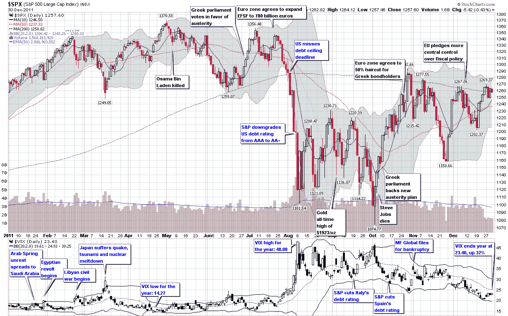

评论：<!--yml

分类：未分类

日期：2024-05-18 16:44:25

→

# 《VIX 和更多：2011 年的 VIX 和波动性》

> 来源：[`vixandmore.blogspot.com/2012/01/year-in-vix-and-volatility-2011.html#0001-01-01`](http://vixandmore.blogspot.com/2012/01/year-in-vix-and-volatility-2011.html#0001-01-01)

我每年最喜欢整理的图表之一就是回顾全年的波动性。我在[2011 年的预期、惊喜和恐惧](http://vixandmore.blogspot.com/2011/12/expectations-surprises-and-fear-in-2011.html)一文中已经以文字形式提到了一些[事件波动](http://vixandmore.blogspot.com/search/label/event%20volatility)的高潮，但在这个案例中，我认为一幅图在整年时间的线轴上能更好地讲述故事。

从波动性的角度看，2011 年上半年相对平静，尽管全球社会经济结构因[阿拉伯之春](http://vixandmore.blogspot.com/search/label/Arab%20Spring)和日本地震、海啸和核泄漏灾难而受到严重冲击。

年中时事情看起来更有希望，当时希腊议会投票支持紧缩政策，欧元区同意将欧洲金融稳定基金（EFSF）扩大到 7800 亿欧元。

在八月初美国债务上限截止日期附近的党派政治问题上，市场曾一度感到相当焦虑，但直到民主党和共和党未能达成有意义的减债协议后，投资者的焦虑才又转回欧洲。讽刺的是，美国债务从 AAA 降级到 AA+对国债证券的实际影响非常小，实际上在降级之后，国债证券开始急剧反弹。然而，当欧洲再次成为焦点时，[主权债务危机](http://vixandmore.blogspot.com/search/label/Italy)正在迅速升级，这次轮到[意大利](http://vixandmore.blogspot.com/search/label/Italy)成为众矢之的。8 月 8 日，VIX 指数飙升到 48，并在 11 月底之前一直保持在 30 以上，创下了[VIX 期货](http://vixandmore.blogspot.com/search/label/VIX%20futures)持续[反向市场](http://vixandmore.blogspot.com/search/label/backwardation)的新记录。

在 8 月和 9 月，VIX 表现得像高空走钢丝，多次触及 40s。即使在 10 月 4 日标普 500 指数触底至 1074 点之后，VIX 在 10 月和 11 月仍然固执地维持在高位，最终在 12 月跌至 20s。虽然标普 500 指数全年基本持平，但 VIX 在 2011 年结束时收于 23.40，比 2010 年收盘价 17.75 上涨了 31.8%。与此同时，VIX 期货预计到 2012 年中旬 VIX 将在 29 至 30 之间，这表明在未来几个月中，波动性将再次上升。

在大多数资产类别苦苦挣扎的一年里，波动性是少数几个伟大的长期投资之一。随着 2012 年起点更高，VIX 要想再次重复其超越市场的表现将非常困难，但如果欧元区和一些地缘政治热点无法取得进展，2012 年或许真的会成为 VIX 的年份。

最后，鉴于去年有很多请求提供高分辨率版本下载，我现提供下面图表的全分辨率 PNG 屏幕截图供下载[此处](http://img683.imageshack.us/img683/7720/theyearinvixandvol2011.png)。

相关文章：

**来源：[StockCharts.com]**

**披露：** 无
