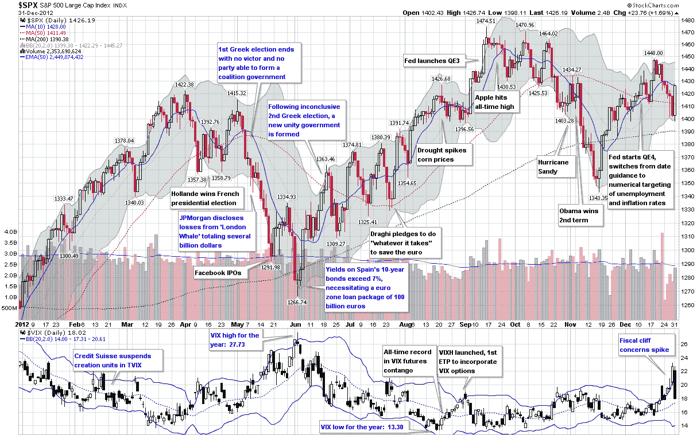

<!--yml

分类：未分类

日期：2024-05-18 16:19:42

-->

# VIX 和 More：2012 年的 VIX 和波动性

> 来源：[`vixandmore.blogspot.com/2013/01/the-year-in-vix-and-volatility-2012.html#0001-01-01`](http://vixandmore.blogspot.com/2013/01/the-year-in-vix-and-volatility-2012.html#0001-01-01)

每年我都会整理一张图表，回顾当年的波动性。尽管 2012 年是自 2006 年以来 VIX 首次未能突破 20 的第一年，但这并不是因为股市没有受到威胁。

在上半年，欧元区成为大多数投资者主要担忧的问题，希腊两次紧张的选举事件从四月持续到六月，一直困扰着市场。随着希腊不再成为头版新闻，[欧洲主权债务危机](http://vixandmore.blogspot.com/search/label/European%20sovereign%20debt%20crisis)的焦点转向了西班牙和意大利不可持续的政府债务收益率，直到马里奥·德拉吉承诺不惜一切代价拯救[欧元](http://vixandmore.blogspot.com/search/label/euro)后，市场才开始好转。

与此同时，由于美联储的反复干预，美国市场相对平静，推出了 QE 2.5、QE3 和 QE4。全球经济也得到了中国、日本和欧元区的中央银行刺激计划的支撑。

2012 年 VIX 和波动性的最后狂欢是[财政悬崖](http://vixandmore.blogspot.com/search/label/fiscal%20cliff)，在美国大选期间被很大程度上忽视，但在最后一票计数之前就占据了头条。财政悬崖问题在整个年度一直是[投资者最担忧的问题](http://vixandmore.blogspot.com/2012/12/just-change-of-venue-fears-about-us.html)，并在 12 月份的大部分时间里使 VIX 与其通常的方向相反。

随着 2013 年的到来，与财政悬崖相关的[恐惧](http://vixandmore.blogspot.com/search/label/fear)正在急剧下降，并拖累了 VIX 的表现，但显然，过去几年一直让金融市场紧张的问题还没有解决，未知的风险总是潜伏在地平线上。

来源：[StockCharts.com]

相关文章：

***披露：*** *无*
