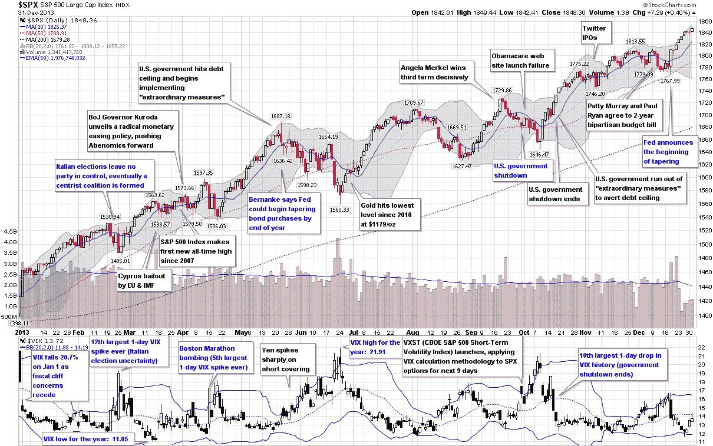

<!--yml

类别：未分类

日期：2024 年 05 月 18 日 16:11:43

-->

# VIX and More：VIX 和波动性的一年（2013 年）

> 来源：[`vixandmore.blogspot.com/2014/01/the-year-in-vix-and-volatility-2013.html#0001-01-01`](http://vixandmore.blogspot.com/2014/01/the-year-in-vix-and-volatility-2013.html#0001-01-01)

这已经是我连续第六年回顾 VIX 和波动性的一年，这是我试图将一年中波动性的亮点压缩到一个图形中，并带有适量的注释。

2013 年在股票波动率和特别是 VIX 方面，是一场持续的牛市和几乎没有暗示或实现波动，至少按照历史标准来看是这样。实际上，2013 年的 VIX 最高水平为 21.91，是自 1995 年以来第二低的年度高点，仅次于 2005 年的格林斯潘流动性泛滥。同样，2013 年的平均 VIX 仅为 14.23，远低于长期平均水平，长期平均水平略高于 20。该年只有两天标普 500 指数上涨 2％或更多，另有两天标普 500 指数下跌至少 2％，这是自 2006 年以来最少的这种日子。

即使数字可能不令人印象深刻，但在一年的过程中仍然发生了一些重大事件，能够引发相当大的焦虑和[恐惧](http://vixandmore.blogspot.com/search/label/fear)，至少是短期内。年初以财政悬崖结束，并且看到了欧元区的恐惧在意大利选举以议会僵局结束后加剧，塞浦路斯银行触发了欧盟/国际货币基金组织对塞浦路斯的联合纾困。波士顿马拉松爆炸案在四月引发了恐怖主义恐惧，而对[日本](http://vixandmore.blogspot.com/search/label/Japan)未来的担忧导致[日元](http://vixandmore.blogspot.com/search/label/Yen)出现巨大波动，这种涟漪效应在五月和六月的货币市场以及许多相关金融市场中都有所感受。

在美国，联邦储备系统缩减方案在年后半段主导了投资格局，债务上限危机、政府停摆和根深蒂固的两党争吵给一些可能自我造成的重大伤害带来了许多疑虑。

最终，2013 年标普 500 指数创下了 44 个新的历史收盘高点，而恐慌指数（VIX）年末比 2012 年结束时下降了近 24％，尽管财政悬崖负责造成了大部分差距。

*[来源：StockCharts.com. VIX and More]*

到目前为止，从波动性的角度来看，2014 年看起来更加有趣，但这一年还很年轻，波动性故事总是以灰色羽毛的黑天鹅形式出现的惊喜之一。

相关文章：

***披露：*** *无*
