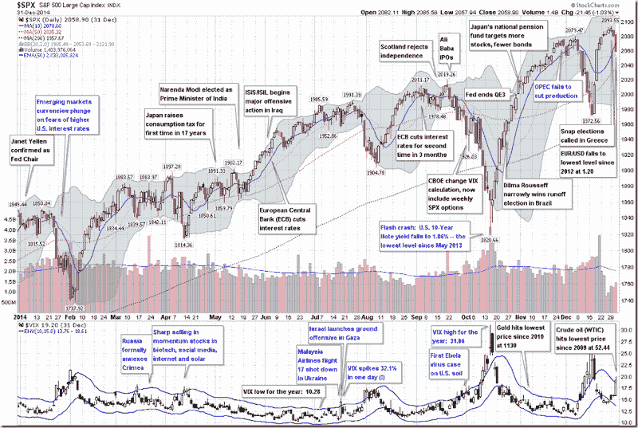

<!--yml

category: 未分类

date: 2024-05-18 16:09:39

-->

# VIX 和更多：2014 年的 VIX 和波动性

> 来源：[`vixandmore.blogspot.com/2015/01/the-year-in-vix-and-volatility-2014.html#0001-01-01`](http://vixandmore.blogspot.com/2015/01/the-year-in-vix-and-volatility-2014.html#0001-01-01)

这是连续第七年我提供对 VIX 和波动性一年的回顾，这是我试图将一年中波动性的亮点浓缩在一张~~眼图~~图表上，并带有(相对)容易管理的注释数量。

总的来说，2014 年是 VIX 非常平静的一年，全年平均收盘价为 14.19，这是自 2006 年以来 VIX 最低的，也是自 1995 年以来的第三低。另一方面，如我最近所记录的，去年的 VIX 激增是常见的，2014 年记录了自 1990 年 VIX 数据开始以来的[第三高 20%的 VIX 激增](http://vixandmore.blogspot.com/2015/01/2014-had-third-highest-number-of-20-vix.html)。简而言之，VIX 容易产生大的激增，但随后通常会出现强烈的[均值回归](http://vixandmore.blogspot.com/search/label/mean%20reversion)下跌。例如，10 月 15 日 VIX 达到 31.06，这是自 2011 年以来最高的 VIX 读数，然而六周后 VIX 又回到了 11 多。

当被问及十月份他们认为对股市最大的威胁是什么时，*VIX 和更多*恐惧调查的受访者将量化宽松的结束和美联储安全网的移除列为他们最关心的问题，而[埃博拉](http://vixandmore.blogspot.com/search/label/Ebola)险胜“市场技术因素”获得第二名。据我所能确定的，是与[对埃博拉疫情的恐惧](http://vixandmore.blogspot.com/search/label/fear)相关的恐慌使 VIX 已经上升并推动其达到 30 多。

一年中不同时间段，[乌克兰](http://vixandmore.blogspot.com/search/label/Ukraine)/[俄罗斯](http://vixandmore.blogspot.com/search/label/Russia)、[原油](http://vixandmore.blogspot.com/search/label/crude%20oil)、ISIS/ISIL、[以色列](http://vixandmore.blogspot.com/search/label/Israel)/加沙、[美联储](http://vixandmore.blogspot.com/search/label/FOMC)和欧洲央行都成功地增加了投资者的焦虑感和风险感知。此外，苏格兰独立公投的险些通过在英国和欧元区造成了混乱，但设法避免了演变成另一场民族主义危机。年初，新兴市场[货币](http://vixandmore.blogspot.com/search/label/currencies)危机触发（回想起来是没有根据的）对美国更高利率的担忧。[生物科技](http://vixandmore.blogspot.com/search/label/biotech)、社交媒体、互联网和太阳能股票等领域的过度投机和估值担忧贯穿全年。在一定程度上，这些担忧在四月达到顶峰（详见[ETP 景观中的修正](http://vixandmore.blogspot.com/2014/04/the-correction-as-seen-in-etp-landscape.html)），但 periodically 在余下的年份里反复出现。

*[点击查看](http://lh4.ggpht.com/-lWCOWU2wCtQ/VMXhYcQ1bFI/AAAAAAAAJYs/Dhvrl_XEYgw/s1600-h/The%252520Year%252520in%252520VIX%252520and%252520Volatility%2525202014%25255B8%25255D.png)*

来源：[StockCharts.com, VIX and More]*

去年这个时候，普遍的担忧集中在美联储主席珍妮特·耶伦是否倾向于更加鹰派的立场，美国利率不可避免地上升，新兴市场货币的贬值以及美联储减缓购债可能带来的潜在后果。回想起来，投资者主要是在担心错误的事情。

2015 年头几周，[希腊](http://vixandmore.blogspot.com/search/label/Greece)、沙特阿拉伯和乌克兰再次成为焦点，瑞士国家银行和欧洲央行在中央银行新闻方面占据主导地位。如果过去有任何指导意义的话，2015 年的大问题可能还没有露出水面，无论它最终是灰天鹅、石墨黑天鹅还是纯粹的黑天鹅。

相关文章：

***披露：*** *无*
