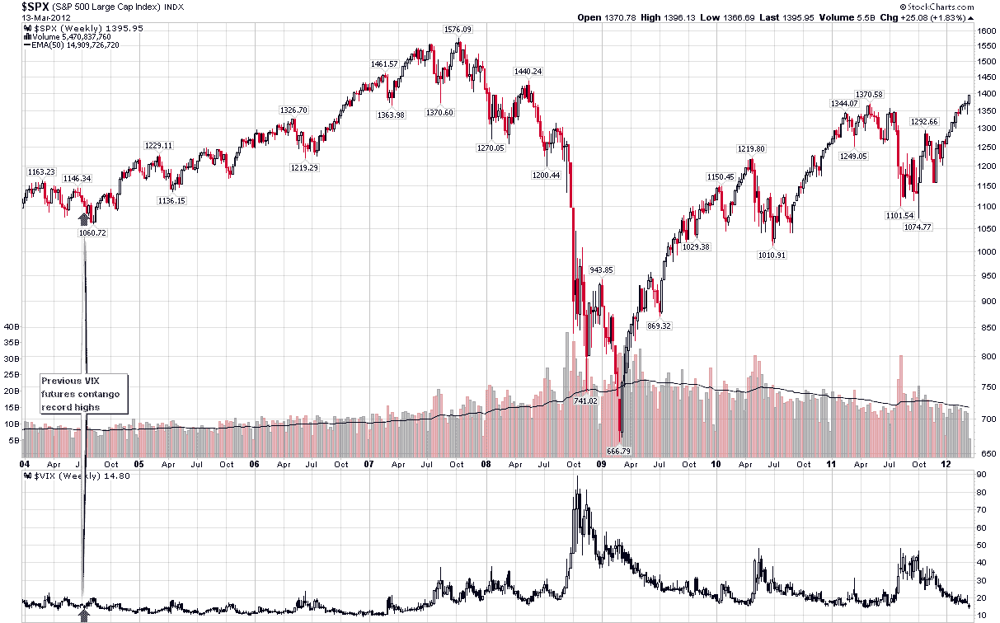

<!--yml

类别：未分类

日期：2024-05-18 16:35:54

-->

# VIX 和更多：第三最陡峭的第一个和第二个 VIX 期货正向合约

> 来源：[`vixandmore.blogspot.com/2012/03/third-steepest-first-second-vix-futures.html#0001-01-01`](http://vixandmore.blogspot.com/2012/03/third-steepest-first-second-vix-futures.html#0001-01-01)

出于各种原因，投资者似乎不愿意接受当前的上涨，随着市场每天的上涨，我在指标森林中看到了一场寻找某种证明的混乱，证明股票最终、不可避免地将进行调整……而且很快。我需要给这种现象起个名字，所以我打算称它为[指标搜寻](http://vixandmore.blogspot.com/search/label/indicator%20hunting)并将其定义为[确认偏差](http://vixandmore.blogspot.com/search/label/confirmation%20bias)的伴侣。

一个多月前，我在[VIX 厨房水槽图说什么](http://vixandmore.blogspot.com/2012/02/what-vix-kitchen-sink-chart-says.html)中讨论了这个问题（它最近没有说太多，但我正在尝试教它手语），当时我注意到了：

> *“2012 年一个更有趣的发展是观察到那种尖锐的看跌叙述的减少，这种叙述主要集中在大量债务与低增长或负增长之间的碰撞航向上。然而，2012 年初的上涨并没有促使许多人加入看涨阵营。相反，关于‘…超买…’的低声变成了柔和的喃喃细语，现在正趋向于成为大声的合唱。突然之间，普遍的共识似乎是股票根本不配他们目前的高估值.*

*> *在这种环境中，许多投资者特别容易受到[确认偏差](http://vixandmore.blogspot.com/search/label/confirmation%20bias)的影响，并急于寻找一个或多个指标，这些指标会告诉他们他们已经开始相信的东西：一个主要调整可能就在附近。“*

毫不奇怪，随着股价的持续上涨，呼声变得越来越尖锐。

当前指标搜寻的一个目标是[VIX 期货](http://vixandmore.blogspot.com/search/label/VIX%20futures) [期限结构](http://vixandmore.blogspot.com/search/label/term%20structure)中的巨大[正向合约](http://vixandmore.blogspot.com/search/label/contango)。有人说它比以往任何时候都要陡峭（它不是），其他人则确信这意味着假设全知的 SPX 期权交易员正在预测市场拐点或即将到来的市场崩盘之间的某件事。

虽然出售恐惧是一个被证明的媒体策略，有时也是一个有吸引力的投资策略，但我认为这些评论家过于高估了 SPX 期权交易员，并且他们在分析上大大偏离了目标。

在下周的[《Expiring Monthly: The Option Traders Journal》](http://www.expiringmonthly.com/)杂志中，我分析了 VIX 期限结构作为预测股市和波动率未来变化的预测器。我们暂且说，至少这些同样的评论家会对结果感到惊讶。

为了说明我的观点，考虑一下，昨天的收盘价是自 2004 年 7 月以来的第一个和第二个月的 VIX 期货合约的最陡峭的 contango 读数。下面的图表突出了记录上的第一个和第二陡峭的（当月和次月）VIX 期货 contango 读数，记录追溯到 CBOE 推出 VIX 期货三个月半之后。观察图表，那两天似乎几乎是随机选择的，当时 SPX 较两周前的高点低了 3.5%，在距一个周期低点还有四周的时候，SPX 还将下跌 4.2%。然而，从更长远的角度看，记录上的 VIX 期货 contango 出现在股市在大幅上涨前暂时喘息的时候。有趣的是，当 VIX 期货 contango 创下记录时，VIX 也约为 15.00，但五个月后，VIX 的交易价格在 11 左右，一年后我们甚至看到了[低于 10](http://vixandmore.blogspot.com/search/label/sub-10)的 VIX。

现在我愚蠢地排除另一个[急剧回调](http://vixandmore.blogspot.com/2012/03/putting-current-26-spx-pullback-in.html)的可能性，但我认为更加愚蠢的是固执地坚持先入为主的观念，忽视市场行动和确认偏差以及指标搜寻（或许甚至是[可用性偏见](http://vixandmore.blogspot.com/search/label/availability%20bias)和[灾难印记](http://vixandmore.blogspot.com/search/label/disaster%20imprinting)）。这些偏见会拖累你的投资组合。

相关帖子：

来源：[StockCharts.com]

***披露(s):*** *CBOE 是 VIX 和 More 的广告商*
