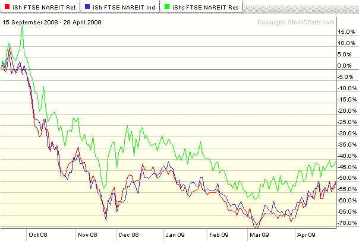

<!--yml

类别：未分类

日期：2024-05-18 17:49:56

-->

# VIX 和更多：三个商业房地产子行业 ETF 观察

> 来源：[`vixandmore.blogspot.com/2009/04/three-commercial-real-estate-sub-sector.html#0001-01-01`](http://vixandmore.blogspot.com/2009/04/three-commercial-real-estate-sub-sector.html#0001-01-01)

我承认在之前的两篇商业房地产文章[商业房地产问题堆积如山](http://vixandmore.blogspot.com/2009/04/commercial-real-estate-problems-piling.html)和[穆迪/REAL 商业地产价格指数](http://vixandmore.blogspot.com/2009/04/moodysreal-commercial-property-price.html)中，将商业房地产当作一个单一的同质实体来处理。

真相是，尽管市场上有很多[REITs](http://vixandmore.blogspot.com/search/label/REITs)涵盖了商业房地产活动的整个范围，但我主要关注的是 ETF，而说到 ETF，大多数受欢迎的房地产 ETF 都是大型的综合类，比如[IYR](http://vixandmore.blogspot.com/search/label/IYR)，[ICF](http://vixandmore.blogspot.com/search/label/ICF)，[VNQ](http://vixandmore.blogspot.com/search/label/VNQ)和[RWR](http://vixandmore.blogspot.com/search/label/RWR)。

虽然我不知道有没有任何专门针对购物中心 REITs、办公室 REITs 或公寓 REITs 的 ETF，但有三个商业房地产子行业的 REIT ETF 可以帮助我们理清 REIT 宇宙内的各种部门趋势。这三个子行业 ETF，截至 4 月 28 日的分配如下：

[FTSE NAREIT 零售加权指数基金](http://us.ishares.com/product_info/fund/overview/RTL.htm) ([RTL](http://vixandmore.blogspot.com/search/label/RTL))

+   52.28% 权益购物中心

+   35.85% 权益区域购物中心

+   11.47% 权益独立建筑

+   0.20% 短期证券

[FTSE NAREIT 工业/办公室加权指数基金](http://us.ishares.com/product_info/fund/overview/FIO.htm) ([FIO](http://vixandmore.blogspot.com/search/label/FIO))

+   54.87% 权益办公室

+   26.92% 权益工业

+   17.93% 权益混合

[FTSE NAREIT 住宅加权指数基金](http://us.ishares.com/product_info/fund/overview/REZ.htm) ([REZ](http://vixandmore.blogspot.com/search/label/REZ))

+   41.98% 权益公寓

+   39.02% 权益医疗保健

+   15.35% 权益自助存储

+   3.37% 权益制造住宅

+   0.07% 短期证券

记录在案，RTL 和 FIO 的流动性有限，这使得它们比交易工具更好的指标，但 REZ 是有活力的交易。

如图所示，零售和工业/办公室 REIT ETF 在雷曼兄弟破产后几乎同步移动，而住宅 ETF 在下行市场中表现较好，但在 3 月份底部反弹时略显缓慢。

**[来源：StockCharts.com]**
