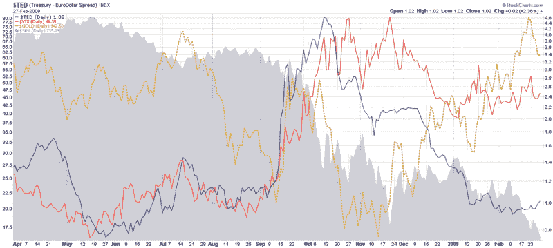

<!--yml

分类：未分类

日期：2024-05-18 17:57:27

-->

# VIX and More: Three Fear Indicators (or…The Three Baritones)

> 来源：[`vixandmore.blogspot.com/2009/03/three-fear-indicators-orthe-three.html#0001-01-01`](http://vixandmore.blogspot.com/2009/03/three-fear-indicators-orthe-three.html#0001-01-01)

虽然 VIX 作为**恐慌**指标吸引了大部分媒体的注意力，但它在反映与美国股市相关的波动方面的作用明显比其他资产类别和经济威胁要好。

[TED 利差](http://vixandmore.blogspot.com/search/label/TED%20spread)在 2008 年受到了广泛的赞誉，作为流动性的衡量标准，是一个合理的**对手方风险**的替代品。当然，**黄金**是最早出现的，几个世纪以来，它一直作为各种投资和其他风险的晴雨表。

在下面的图表中，我将 VIX、TED 利差和黄金与过去一年 SPX 下跌的背景进行了叠加。注意，在这三者中，TED 利差最早达到峰值，是在十月的第二周，随后很快下降，随着流动性问题的缓解而退居次要地位。VIX 是下一个达到峰值的，但到了十一月底也开始下降，因为系统性崩溃的恐慌开始慢慢消退。

图表上最有趣的一条线是黄金的价格，实际上在十一月中旬触底，并在过去三个月里急剧上升，部分原因是恐慌投资者的避风港，但也作为对政府为恢复经济而采取的各种财政政策方法所引发通胀风险的避险。

总之，TED 利差已经回吐了九月至十月的全部涨幅，VIX 回吐了九月至十一月的涨幅的一半，而黄金在回吐了十一月至二月的 20%涨幅后似乎暂停了。目前来看，TED 利差和 VIX 似乎是旧消息，而黄金可能是当前市场条件下最好的恐慌指标。

*[来源：StockCharts]*
