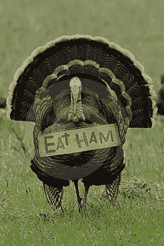

<!--yml

category: 未分类

date: 2024-05-18 18:53:24

-->

# VIX 和更多：来自远方的三个值得注意的帖子

> 来源：[`vixandmore.blogspot.com/2007/11/three-noteworthy-posts-from-afar.html#0001-01-01`](http://vixandmore.blogspot.com/2007/11/three-noteworthy-posts-from-afar.html#0001-01-01)

在博客圈里，很难真正说清楚“远方”是什么——甚至是否真的存在这样的东西——但我想利用这个空间来突出最近引起我注意的三个 VIX 相关的帖子。

今天早上早些时候，[宏观先生](http://macro-man.blogspot.com/)（其知识领域远超宏观）在标题为[恐惧与贪婪](http://macro-man.blogspot.com/2007/11/fear-and-greed.html)的帖子中思考了 VIX、信贷市场和美国消费者思维方式的汇聚可能对市场未来方向意味着什么。记录在案，我已经在[多次场合](http://vixandmore.blogspot.com/search/label/SPX-VIX%20correlation)上评论了 SPX 和 VIX 之间的相关性，并指出高正相关性更可能预示着熊市行情，而不是高负相关性。

亚当在[每日期权报告](http://adamsoptions.blogspot.com/)（尽管他发帖频繁，他还有时间交易吗？）昨天在[VIX 向前看](http://adamsoptions.blogspot.com/2007/11/vix-going-forward.html)中预见了一些情况，讨论了假日效应以及交易员为了更好地将短交易周与七天的日历周匹配而降低出价的趋势。他的假日效应预测：“这周板上的波动率数字可能具有误导性地下跌。” 宾果！

再远一点，周末，布雷特·斯蒂恩巴格在[交易者饲料](http://traderfeed.blogspot.com/)上发布了一些非常有趣的研究和分析，标题为[股市中的羊群行为：成交量集中度的观察](http://traderfeed.blogspot.com/2007/11/herding-behavior-in-stock-market-look.html)。坦率地说，这可能是我今年读过的最有趣的股市帖子；我就不试图概述他的想法了，我建议你点击阅读他的原文以及相关后续帖子[股市中的羊群情绪与预期指数回报](http://traderfeed.blogspot.com/2007/11/herding-sentiment-in-stock-market-and.html)。在吃火鸡（火腿？）三明治之间，我当然会思考市场情绪、波动性和羊群行为。

祝大家假期愉快。
