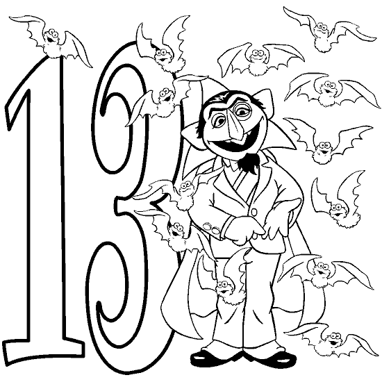

```

分类：未分类

日期：2024-05-18 19:11:01

```

# VIX and More: Three Out of Four, Unlucky or More

> 来源：[`vixandmore.blogspot.com/2007/06/three-out-of-four-unlucky-or-more.html#0001-01-01`](http://vixandmore.blogspot.com/2007/06/three-out-of-four-unlucky-or-more.html#0001-01-01)

请原谅我使用了一个听起来像儿歌的标题，但在[Trivial Pursuit](http://www.trivialpursuit.com/)热潮期间，我发现的其中之一就是我的童年严重缺乏儿歌。

幸运的是，这种情况相对温和，但它已经在我的成年生活中通过偶尔的[Seuss](http://en.wikipedia.org/wiki/Dr._Seuss)韵律和一些听起来很傻的博客文章标题表现出来...

但 enough about me; volatility is the real star here.

最近波动性如何？

那是一个很难回答的问题，但有了 Excel

[Ginsu](http://en.wikipedia.org/wiki/Ginsu)

，我总是能至少想出两个或三个不同的答案。试试这个大小：过去四天中有三天见证了 VIX 的 13%或以上的变化…而这在过去的 15 年中只发生过两次。你可能很清楚那两次的其他情况：2007 年 2 月 27 日至 3 月 2 日和 2006 年 6 月 12 日至 16 日。每次这些情况都在重要的底部之前发生。

这意味着底部就在拐角处吗？简直…但我还是为了安全起见计算了一些更多的数字。结果证明，这四天中的三天波动性聚集通常与中级市场底部相关，而不是市场顶部行动。所以尽管这种行动可能对一些人来说是顶部，但从历史上看，它比熊市更具有牛市特征。

当然，现在我剩下的是如何通过 VIX 的眼睛最好地识别顶部市场。我的直觉是

[Bollinger 带宽](http://vixandmore.blogspot.com/search/label/Bollinger%20band%20width)

可能是这里的关键，但我会再思考一下这个问题，当我有什么有趣的话要说时再报告。
