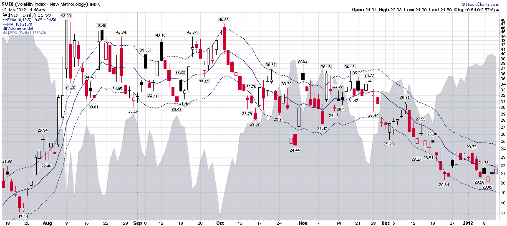

<!--yml

类别：未分类

日期：2024-05-18 16:43:35

-->

# VIX 和更多：紧缩的 VIX 范围使超买信号得以控制

> 来源：[`vixandmore.blogspot.com/2012/01/tight-vix-range-keeps-overbought.html#0001-01-01`](http://vixandmore.blogspot.com/2012/01/tight-vix-range-keeps-overbought.html#0001-01-01)

昨天的 VIX 小趣事（[VIX 有史以来最小的日内波动范围！](http://vixandmore.blogspot.com/2012/01/vix-has-smallest-intraday-range-ever.html)）正好是我预料中会引发许多人关注的内容，直到每个人都认为标题与实际数据点不成比例。讽刺的是，这正是文章意图的一部分：嘲笑那些预测价值可疑的统计异常和极端读数。

我对紧缩的日内 VIX 范围思考得越多，就越相信它是一个很好的过渡，引出了一个更重要的相关观点：VIX 的狭窄交易范围——以及股票市场的一般情况（标普 500 的 10 日[历史波动率](http://vixandmore.blogspot.com/search/label/historical%20volatility)降至 12s）正在使股票价格上涨，而不会触发任何超买信号。

跟踪 VIX 是否发出超买或超卖信号的一种方法是使用 VIX 与其 10 日移动平均值的比例。为了使这个数据一目了然，我偏爱使用[移动平均包络](http://vixandmore.blogspot.com/search/label/moving%20average%20envelopes)（MAEs），它能够迅速标出 VIX（或任何其他底层资产）与其移动平均值相差甚远的情况，这与[布林带](http://vixandmore.blogspot.com/search/label/Bollinger%20bands)测量异常值的方式相似。

我个人偏好使用 VIX 的 10 日移动平均值作为基准，并将 MAEs 设置为 10%、12.5%或 15%，具体取决于市场的基础波动性。在下面的图表中，我将 MAEs 设置为 10 天和 12.5 天。结果是，VIX 在过去 2 个半周内一直紧贴中心线（10 日移动平均值），从未威胁到虚线的蓝色 MAE 线。

在许多方面，VIX 最近的活动是市场整体活动的缩影：股票继续上涨，但涨幅不够快，不能触发许多首选的超买警报。

相关文章：

**[数据来源：StockCharts.com]**

***披露信息：*** *无*
